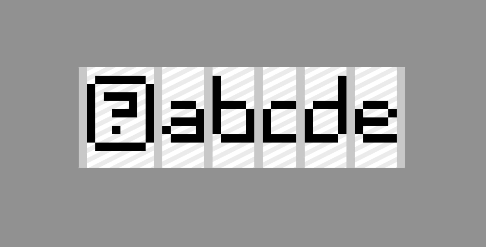
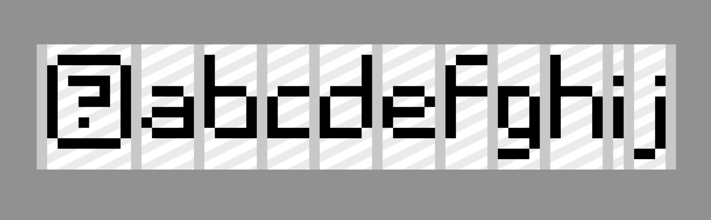
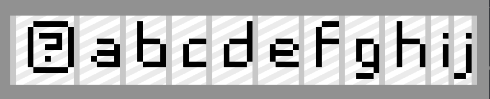

.. _custom_font_guide:

Custom PixelFonts
===================================================

This page assumes that you've read the :ref:`Font Guide<font_guide>`.

Basic Setup
----------------

To create a font using PixelFont, first create an PNG image in your project files. This image can be loaded using the syntax below.
The :code:`characters` parameter is a string containing every character that your PixelFont will support.

.. code-block:: python

    font = ember.PixelFont("path/to/font.png", characters="abcde")

Let's go over what your font PNG should look like. An example is shown below. For this example, I want my font to support the characters :code:`abcde`.

The leftmost character on the font sheet is used to represent an 'unknown character' - a character that isn't supported by the font. For example, if :code:`f` is rendered, this character will be displayed instead because :code:`f` is not in our font's list of supported characters (:code:`abcde`).

To the right of the 'unknown' character, I've drawn each character that I want my font to support. You must draw these characters in the order that they appear in the PixelFont :code:`characters` parameter.

Each character should be drawn in black - Ember will change the color of the text as needed.

.. note::
    If you instead wish to include the color information on the font sheet itself, you may do so. Rendering the text in black within Ember will preserve the colours seen on the font sheet. However, rendering the text in any color other than black may produce undesirable results.

Inbetween each character, a vertical line ('seperator') should be drawn. This tells Ember where the boundaries between the characters are. By default, the separator color is :code:`(200, 200, 200)`. If you wish, you can change this by specifying the :code:`separator_color` parameter in the PixelFont constructor:

.. code-block:: python

    font = ember.PixelFont("path/to/font.png", characters="abcde", separator_color=(255, 0, 0))

Character Padding
--------------------

Sometimes, we may want part of one letter to extend below other letters. To illustrate this, let's add some more letters to our font.

If we use this font sheet to render the text :code:`abcdefghij`, we get the following output:

Because of the descender on the letter J, the space between I and J appears to be larger than the spaces between the other letters.
Instead, we want the descender of the letter J to extend *underneath* the letter I.

To fix this, we can use the :code:`character_padding` parameter. This allows you to specify how much additional padding is included on the left and right of each character in the sheet. In this case, we can specify :code:`(2, 0)` to indicate that there will be 2 pixels of padding
on the left and 0 pixels on the right.

.. code-block:: python

    font = ember.PixelFont("path/to/font.png", characters="abcdefghij", character_padding=(2, 0))

Then, we can modify the font sheet to add the 2 pixels of padding to each character:

Note that the stem of the letter J is 2 pixels away from the separator, but the descender extends into the padded area. Anything inside of this padded area will overlap with the previous character in the rendered text.

Here's what the text looks like now:

Additional Parameters
------------------------

"Kerning" refers to the spacing between each character. You can adjust the kerning by modifying the :code:`kerning` parameter
as shown below. By default, a kerning value of 1 will be used.

.. code-block:: python

    font = ember.PixelFont("path/to/font.png", characters="abcde", kerning=2)
