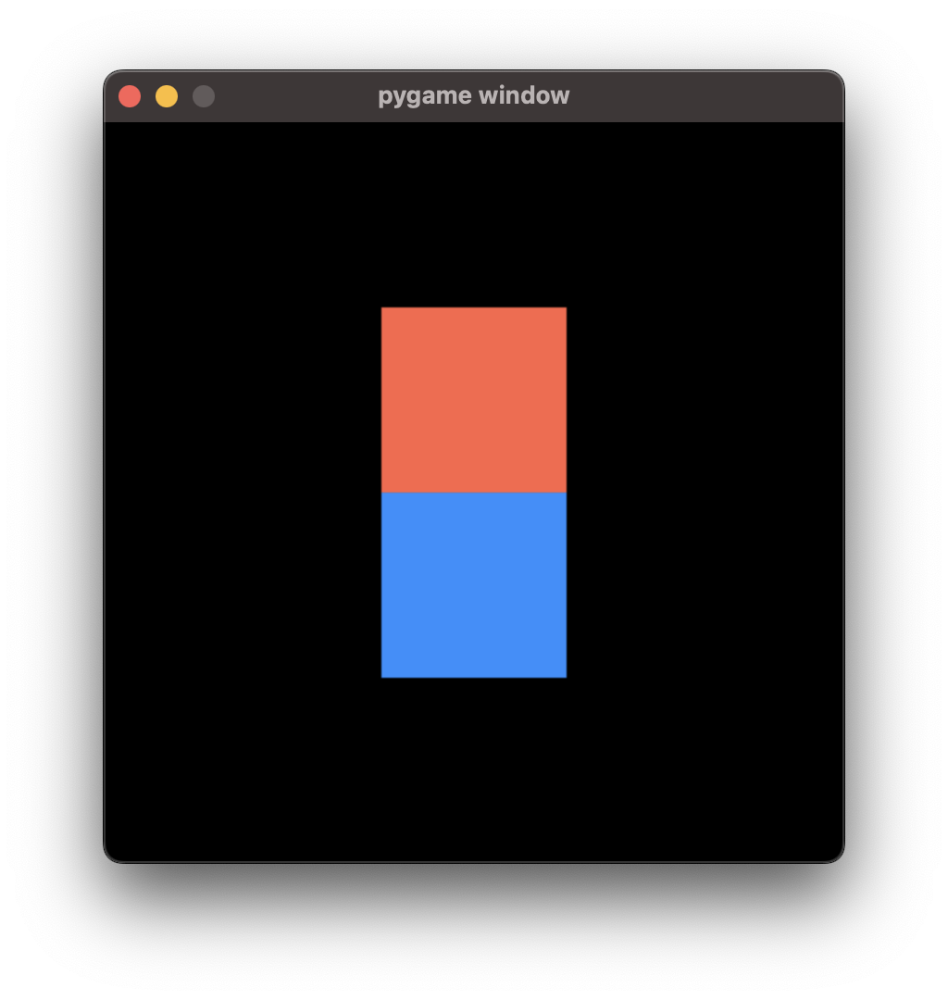
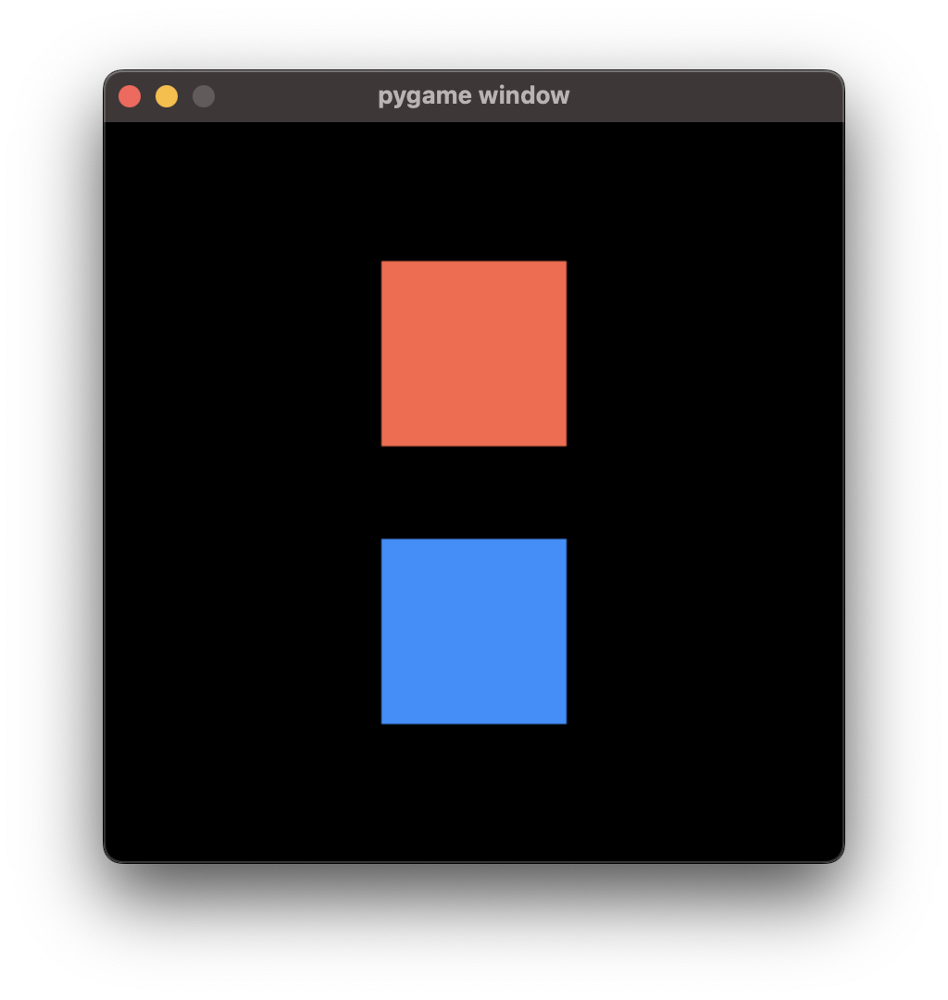
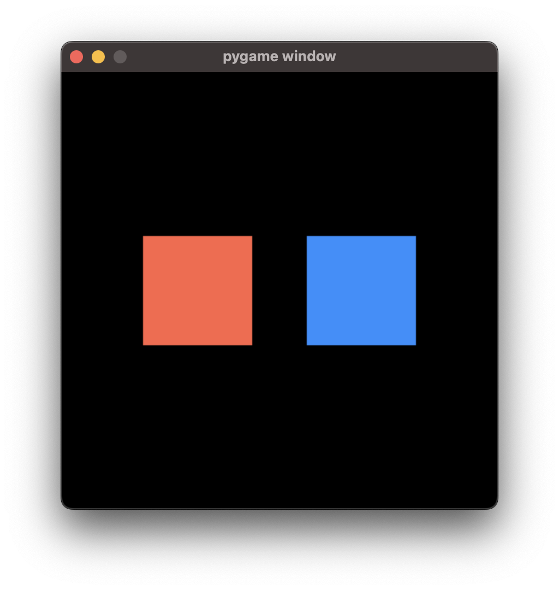
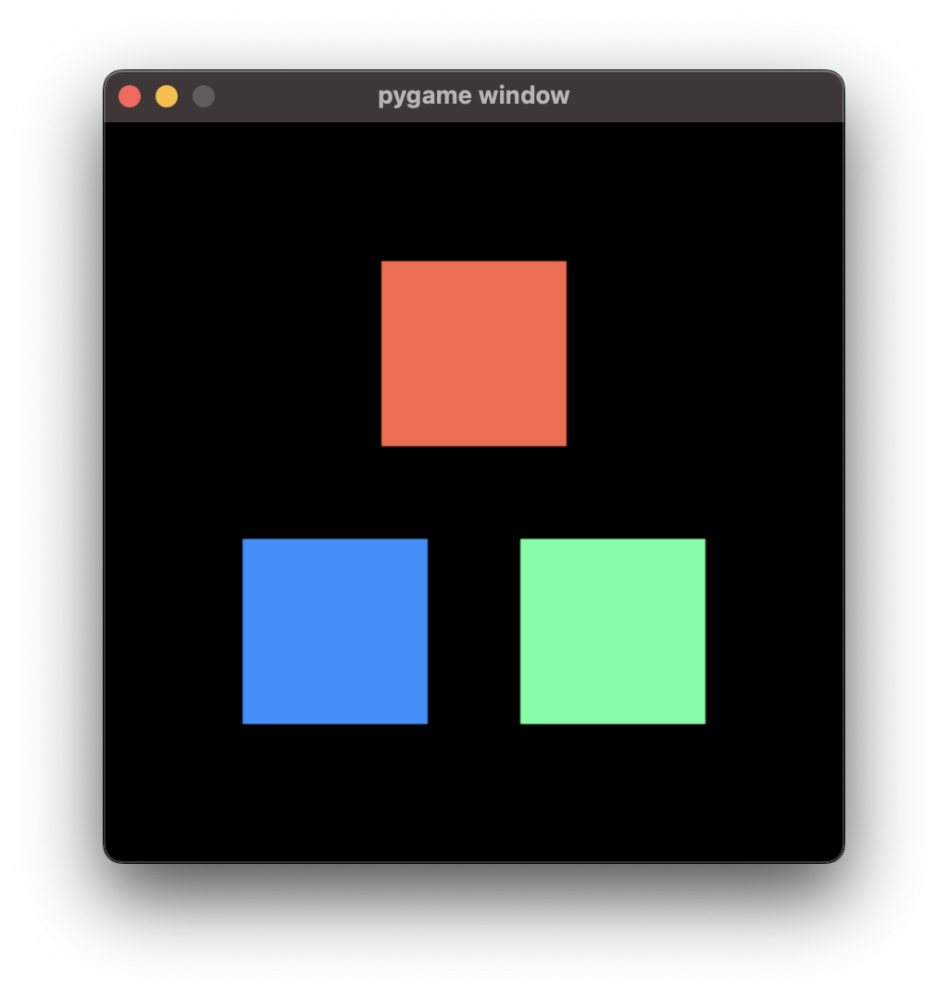
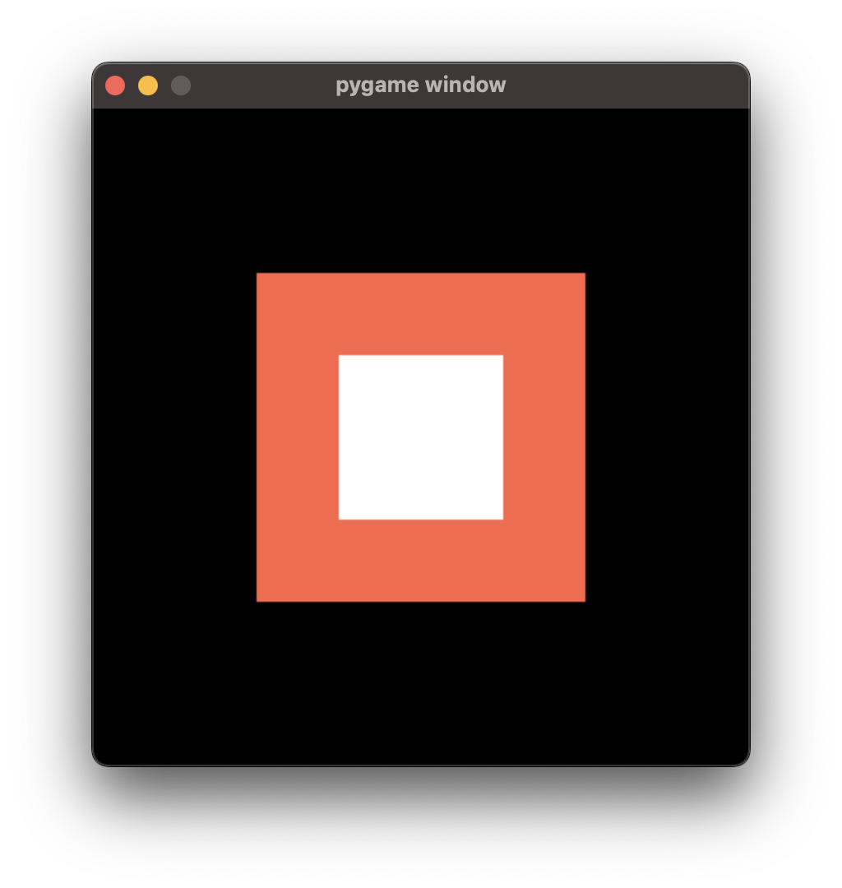
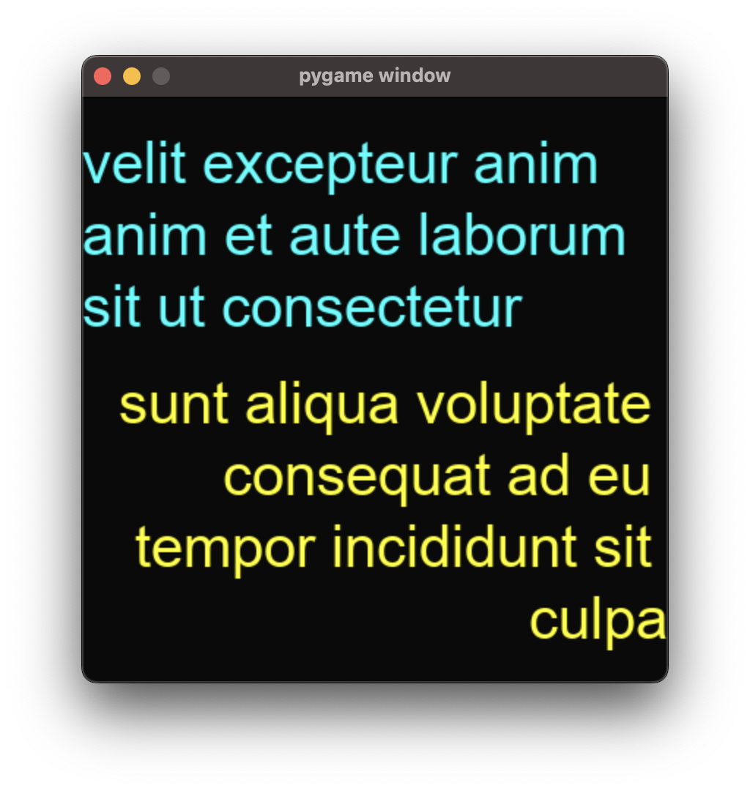
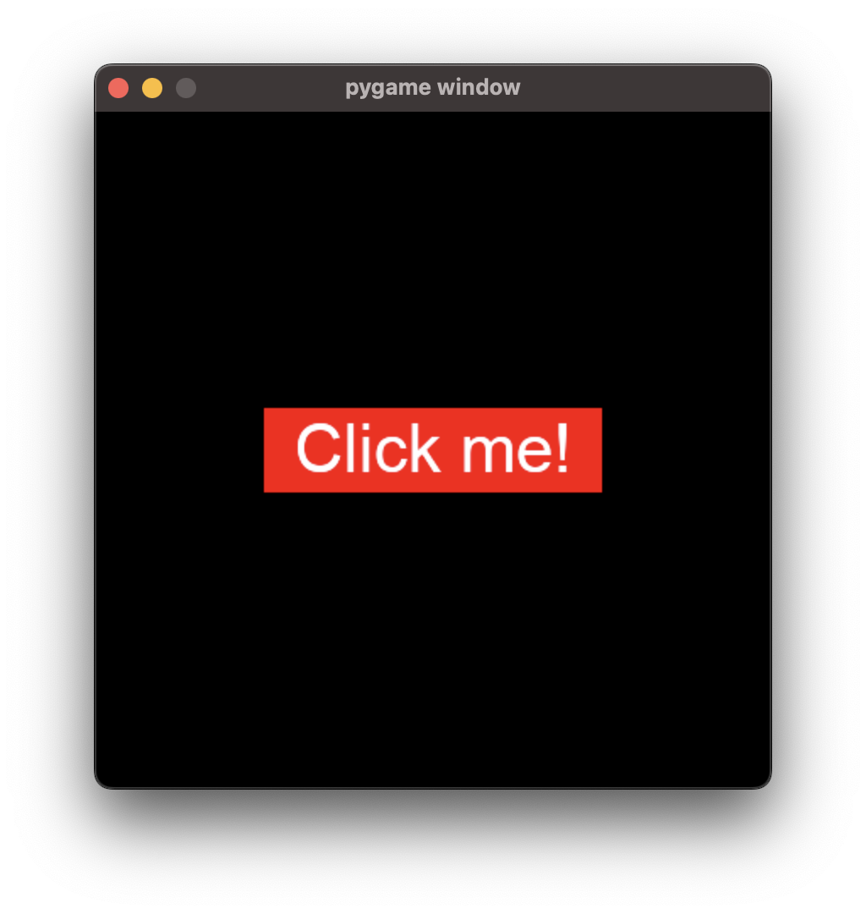
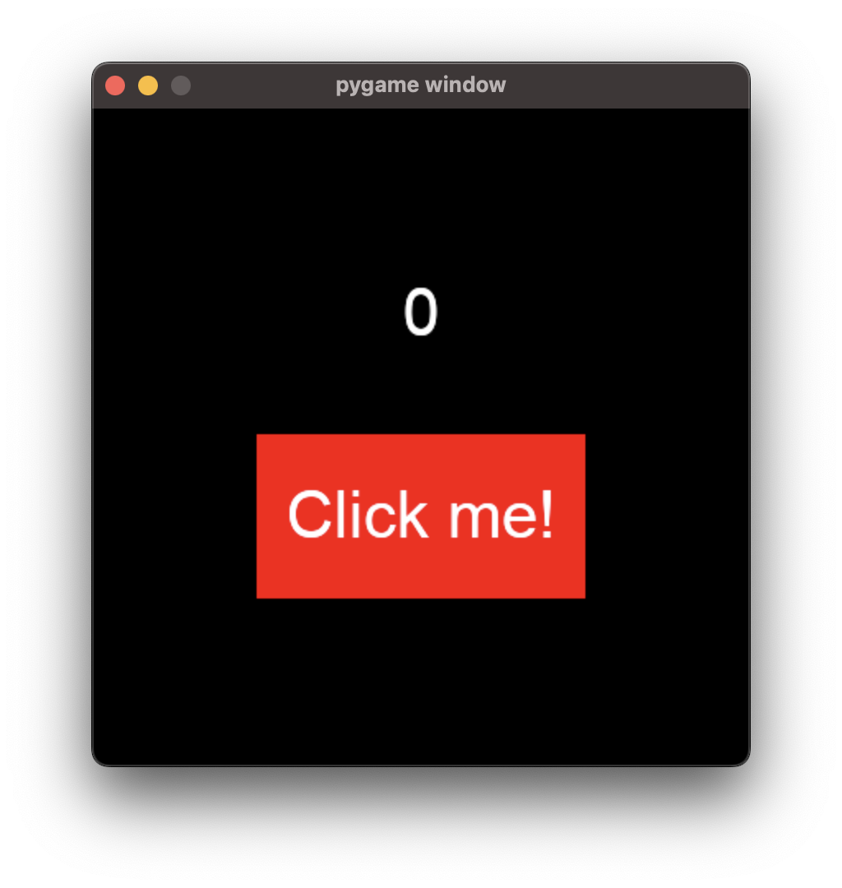
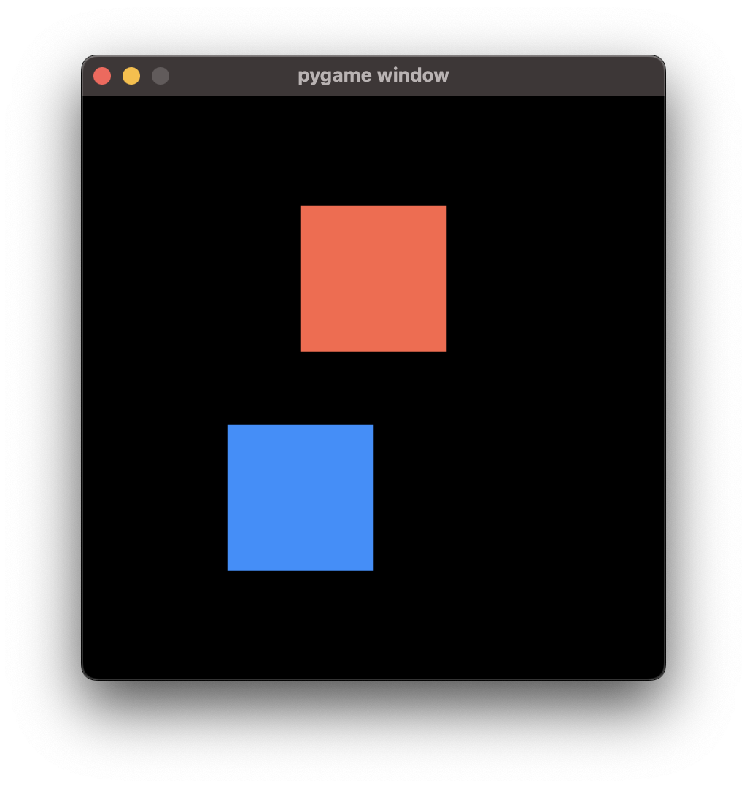

.. _element_guide:

Getting Started
===================================================

Welcome! This series of guides will teach you everything you need to know about Ember.

**This guide assumes a strong knowledge of Python (including OOP) and Pygame. There is a lot to get through, and we will not be stopping to explain Python or Pygame mechanics.**

Basic Setup
------------------------

Let's create a basic project with Ember.

Here's some sample code that we'll be building upon to create a menu. You may wish to copy this code into your editor so that you can experiment with the library yourself whilst reading.

.. code-block:: python
   :linenos:
   :emphasize-lines: 7, 8

    import pygame
    import ember

    pygame.init()
    clock = pygame.time.Clock()

    ember.init()
    ember.set_clock(clock)

    screen = pygame.display.set_mode((400, 400))

    running = True
    while running:
        for event in pygame.event.get():
            if event.type == pygame.QUIT:
                running = False

        screen.fill("black")
        clock.tick(60)
        pygame.display.flip()

    pygame.quit()

In any Ember project, it is necessary to pass your pygame Clock to Ember using :py:func:`ember.set_clock()` at the start of your program so that Ember can perform delta-time calculations.

This sample code produces a black screen. Next, we'll look at adding some UI elements to the screen.

Creating a UI Element
------------------------

Ember offers a variety of different UI object types in the form of "Element" classes. There are Element classes for buttons, text fields, sliders, and more.

First, we’ll look at the :py:class:`ember.Panel<ember.ui.Panel>` element. This is very a basic element that represents a rectangle filled with a solid color. It cannot be interacted with by the user.

.. code-block:: python

    panel = ember.Panel("red", size=(100, 100))

To render our panel on the screen, we'll need to create a :py:class:`ember.View<ember.ui.View>` object. A View can have one Element attributed to it, and is responsible for rendering that element. Let's create a View to hold our Panel.

.. code-block:: python

    panel = ember.Panel("red", size=(100, 100))
    view = ember.View(panel)

In order for the View to render its child element on the screen, you must call :py:meth:`View.update<ember.ui.View.update>` each tick, and :py:meth:`View.event<ember.ui.View.event>` for each event in the Pygame event stack.

I've added a View to the previous example script. The changes I've made are highlighted.

.. image:: _static/element_guide/panel1.png
  :width: 160
  :align: right

.. code-block:: python
   :linenos:
   :emphasize-lines: 12,13,14,19,24

    import pygame
    import ember

    pygame.init()
    clock = pygame.time.Clock()

    ember.init()
    ember.set_clock(clock)

    screen = pygame.display.set_mode((400, 400))

    view = ember.View(
        ember.Panel("tomato", size=(100, 100))
    )

    running = True
    while running:
        for event in pygame.event.get():
            view.event(event)
            if event.type == pygame.QUIT:
                running = False

        screen.fill("black")
        view.update(screen)

        clock.tick(60)
        pygame.display.flip()
    pygame.quit()

Resizing Elements
------------------------

In the example code above, we passed :code:`(100, 100)` as the :code:`size` argument of our Panel as shown:

.. code-block:: python

    ember.Panel("tomato", size=(100, 100))

This means that our Panel is 100 pixels wide and 100 pixels tall. All Element types can be sized in this way. This is not the only way you can specify element size - you can also specify the width and height seperately:

.. code-block:: python

   ember.Panel("tomato", w=100, h=100)

Or, if you only pass a single value as the :code:`size` argument, it will be used for `both` the width and height of the Element.

.. code-block:: python

   ember.Panel("tomato", size=100)

Multiple elements in a View
---------------------------------------------
A View can only hold **one** element at a time. If we want to display more than one element in a View, we have to wrap our elements in a 'Container'. A Container is a type of element that can hold other elements inside of it.

There are several different containers that you can use. Each type of container arranges its child elements in a different way.

The first container we'll look at is the :py:class:`VStack<ember.ui.VStack>` container. You can pass any number of elements to the VStack constructor, and they will be displayed in a vertical list on the screen when the View is rendered.

.. code-block:: python

    view = ember.View(
        ember.VStack(
            ember.Panel("tomato", size=100),
            ember.Panel("dodgerblue", size=100),
            size=(100, 200)
        )
    )

Note that :py:class:`VStack<ember.ui.VStack>`, like Panel, accepts a size. Though the area occupied by the VStack itself is invisible, it still has a set size in the same way that Panel does.
In the example code above, I've set the VStack to match the exact size of the two panels contained within it.

If we increase the height of the VStack, a gap will be formed between the two elements (see image). This is because VStack will space its child elements out so that they completely fill the height of the VStack.

Similarly to VStack, the :py:class:`HStack<ember.ui.HStack>` container displays elements in a horizontal list:

.. code-block:: python

    view = ember.View(
        ember.HStack(
            ember.Panel("tomato", size=100),
            ember.Panel("dodgerblue", size=100),
            size=(250, 100)
        )
    )

In the above example each Panel is 100 pixels wide, while the HStack is 250 pixels wide. This means that there will be a 50 pixel gap between the two Panels.

Remember, containers such as :py:class:`VStack<ember.ui.VStack>` and :py:class:`HStack<ember.ui.HStack>` are Elements just like :py:class:`Panel<ember.ui.Panel>` is. This means you can nest them inside of each other like this:

.. code-block:: python

    view = ember.View(
        ember.VStack(
            ember.Panel("tomato", size=100),
            ember.HStack(
                ember.Panel("dogerblue", size=100),
                ember.Panel("seagreen1", size=100),
                size=(250, 100)
            ),
            size=(250, 200)
        )
    )

There is no limit to how many times you can nest Containers in this way.

'Fit' Sizes
-----------------------------

Consider this Element tree that we looked at earlier:

.. code-block:: python

    view = ember.View(
        ember.HStack(
            ember.Panel("tomato", size=100),
            ember.Panel("dodgerblue", size=100),
            size=(200, 100)
        )
    )

Here, we've specified the size of the :py:class:`HStack<ember.ui.HStack>` as :code:`(200, 100)`. However, we don't need to do this explicitly.

In addition to accepting integers as size values, Elements can accept a number of other 'size types' defined within ember.
These size types are available from the :code:`ember.size` module, and allow elements to have 'implicit' sizes - this means that
the integer values represented by these size types aren't absolute; instead, their values are based on some condition.

One of these size types is :py:class:`ember.size.FitSize`. When used as a size value for a Container, it tells the Container to set its width/height
relative to the width/height of its contents. In the example above, we can use this size type inplace of :code:`(200, 100)` as the size of the HStack.
This means that if we change the contents of the HStack later, we won't need to update the size of the container to match. This is a huge benefeit when
you have a large element tree with many elements that need to depend on the size of their contents.

Let's create a :py:class:`FitSize<ember.size.FitSize>` object, and use it as the size for our HStack. The same FitSize instance can be used in as many
places as you like - you don't need to create a new one each time if you don't want to.

.. code-block:: python

    fit_size = ember.size.FitSize()

    view = ember.View(
        ember.HStack(
            ember.Panel("tomato", size=100),
            ember.Panel("dodgerblue", size=100),
            size=fit_size,
        )
    )

The HStack will still have a size of :code:`(200, 100)` after this modification, because that is the exact size taken up by the two Panels when placed side-by-side.
FitSize can optionally accept a couple of keyword arguments that modify its behaviour - we'll look at those later.

Because :py:class:`FitSize<ember.size.FitSize>` is used very frequently in ember, an instance of it is available as :code:`ember.FIT` for convenience:

.. code-block:: python

    view = ember.View(
        ember.HStack(
            ember.Panel("tomato", size=100),
            ember.Panel("dodgerblue", size=100),
            size=ember.FIT,
        )
    )
    

Default Sizes
------------------------

All elements have a 'default size' that they adopt if you don't specify a size value yourself.
Each element type has a default value for each dimension - a default width and default height.
For :py:class:`VStack<ember.ui.VStack>` and :py:class:`HStack<ember.ui.HStack>`,
the default size is :code:`ember.FIT` for both the width and height of the container.
This means that, if you want one of those Containers to use a :code:`ember.FIT` size,
you don't need to specify a size at all!

.. code-block:: python

    # The HStack here has ember.FIT as its size

    view = ember.View(
        ember.HStack(
            ember.Panel("red", size=100),
            ember.Panel("blue", size=100)
        )
    )

Similarly, if you only specify one size dimension, the default size will be adopted for the dimension that you don't specify a value for.

.. code-block:: python

    # The HStack here has ember.FIT height and a width of 250

    view = ember.View(
        ember.HStack(
            ember.Panel("red", size=100),
            ember.Panel("blue", size=100),
            w=250
        )
    )

Modifying the contents of a container
---------------------------------------------------

In the examples we've looked at so far, we've attributed elements to containers by passing them as arguments to the container constructor, like this:

.. code-block:: python

    ember.VStack(
        ember.Panel("tomato", size=100),
        ember.Panel("dodgerblue", size=100)
    )

This isn't the only way to add elements to containers. VStack and HStack support many of the methods that :code:`list` does, 
which you can use to modify the contents of the container after you've created it. For example:

.. code-block:: python

    stack = ember.VStack(
        ember.Panel("tomato", size=100),
    )
    
    view = ember.View(stack)
    
    new_panel = ember.Panel("dodgerblue", size=100)
    stack.append(new_panel)

You can also get and set items directly, just like in a python list:

.. code-block:: python

    stack = ember.VStack(
        ember.Panel("tomato", size=100),
        ember.Panel("dodgerblue", size=100)
    )

    stack[1] = ember.Panel("seagreen1", size=100)

You can modify the contents of a container at any time. For example, you could write some code that adds a new element to a
container when the space key is pressed. If the container being modified has a :code:`FIT` size, the container's
size will be updated intelligently to fit the new size of the Container's contents.

Using :code:`with` syntax
-----------------------------

We can add elements to a container using the :code:`with` statement, too.
When an element is instantiated within the context of a container,
it will be added to that container when the context is exited.

.. code-block:: python

    with ember.VStack() as stack:
        ember.Panel("tomato", size=100)
        ember.Panel("dodgerblue", size=100)

This also works with View:

.. code-block:: python

    with ember.View() as view:
        ember.Panel("tomato", size=100)

Using this syntax can make our element trees much cleaner. Consider this large element tree:

.. code-block:: python

    view = ember.View(
        ember.VStack(
            ember.Panel("tomato", size=100),
            ember.HStack(
                ember.Panel("dodgerblue", size=100),
                ember.Panel("seagreen1", size=100),
                size=(200, 100)
            ),
            size=(200, 200)
        )
    )

Using :code:`with` syntax, we can rewrite this as:

.. code-block:: python

    with ember.View() as view:
        with ember.VStack(size=(200, 200)):
            ember.Panel("tomato", size=100)
            with ember.HStack(size=(200, 100)):
                ember.Panel("dodgerblue", size=100)
                ember.Panel("seagreen1", size=100)

This alternative way of constructing menus is often much more convenient than nesting element constructors,
because you can run additional code (such as keeping a reference to an element as a variable) whilst creating your menu.

For example, you can use a :code:`for` loop to create multiple elements like this:

with ember.View() as view:
    with ember.VStack():
        for color in ("tomato", "dodgerblue", "seagreen1"):
            ember.Panel(color, size=100)

ZStack
------------------------

We've seen that VStack stacks elements vertically, and HStack stacks elements horizontally.
Next, we'll look at a new container type - :py:class:`ZStack<ember.ui.ZStack>`.
This container stacks elements ontop of one another, from back to front.

.. code-block:: python

    with ember.View() as view:
        with ember.ZStack(size=ember.FIT):
            ember.Panel("tomato", size=200)
            ember.Panel("white", size=100)

When :code:`ember.FIT` is used with ZStack, ZStack adopts the size of its largest child element.
In this case, the ZStack will have 200 pixels on both axis, because its largest child element
(the red Panel) has that size. Just like with VStack and HStack, :code:`ember.FIT` is the default size for ZStack.

Text
------------------------

Next, we'll look at another basic element type. :py:class:`ember.Text<ember.ui.Text>` can be used to render some text on the screen. We can create a Text object like this:

.. code-block:: python

    font = ember.PygameFont(pygame.SysFont("arial", 40))
    text = ember.Text("Hello world!", color="white", font=font)

We can also pass the font name and size directly to PygameFont instead, and ember will create the :code:`pygame.SysFont` object for us:

.. code-block:: python

    font = ember.PygameFont("arial", 40)
    text = ember.Text("Hello world!", size=200, color="white", font=font)

Lets use our Text object in a View:

.. code-block:: python

    font = ember.PygameFont("arial", 40)

    with ember.View() as view:
        ember.Text("Hello world!", size=200, color="white", font=font)

Just like any other element, Text has a size. The text itself will be rendered in the center of the Text object by default.
The Text element will attempt to render as much of the text as will fit within the width of the Text on one line, and then wrap it to the next line.

Using :code:`ember.FIT` as a size value for Text will cause the Text to match the size of it's content. :code:`ember.FIT` is the default size for Text.

We can modify the contents of Text after its creation using the :py:meth:`set_text()<Text.set_text()>` method.

Buttons
------------------------

Lets look at our first interactive element - the :py:class:`Button<ember.ui.Button>`. Button behaves very similarly to ZStack - it contains multiple elements that are stacked ontop of one another.

.. code-block:: python

    font = ember.PygameFont("arial", 40)

    with ember.View() as view:
        with ember.Button(size=(200, 50)):
            ember.Panel("red", size=(200, 50))
            ember.Text("Click me!", color="white", font=font)

When the user clicks the Button, an :code:`ember.BUTTONCLICKED` event is emitted. You can listen for this event in the Pygame event stack just like you would with any Pygame event.
The :code:`ember.BUTTONCLICKED` Event object has the :code:`element` attribute, which is a reference to the button that posted the event.

Example usage:

.. code-block:: python

    for event in pygame.event.get():
        if event.type == ember.BUTTONCLICKED:
            if event.element is my_button:
                print(f"Button was clicked!")

'Fill' Sizes
------------------------

Previously, we've used :py:class:`ember.size.FitSize` to make an element shrink to fit the size of it's contents.
Now, we'll look at :py:class:`ember.size.FillSize`. In a similar way, elements with a FillSize will _expand_ to fill the maximum space available.

Just like with FitSize and :code:`ember.FIT`, an instance of FillSize is available as :code:`ember.FILL` for convenience.

Consider this example:

.. code-block:: python

    # The panel will have a size of (200, 100) - the maximum size available within the Button.

    with ember.Button(size=(200, 50)) as button:
        ember.Panel("red", size=ember.FILL)
        ember.Text("Hello world", color="white", font=font)

:code:`ember.FILL` is the default size for Panel elements, so we actually don't need to specify a size at all here.

.. code-block:: python

    # The panel still has a FILL size, because it is the default.

    with ember.Button(size=(200, 50)) as button:
        ember.Panel("red")
        ember.Text("Hello world", color="white", font=font)
        
Note that using FIT and FILL in conjunction can cause errors if there is nowhere to infer a size value from. Consider this code, which would raise an error:

.. code-block:: python

    with ember.VStack(w=ember.FIT):
        ember.Panel("white", w=ember.FILL, h=20)
        
The Panel has a width of ember.FILL, so it tries to expand to the width of the VStack. But the VStack has a width of ember.FIT, so it tries to shrink to the width
of its contents! This causes a conflict, and an error is raised.

Writing this is OK though:

.. code-block:: python

    with ember.VStack(w=ember.FIT):
        ember.Panel("white", w=ember.FILL, h=20)
        ember.Panel("red", w=50, h=20)
        
Now, the VStack is able to shrink to the width of the red panel because the red panel has an explicit size.
The white panel is then able to expand to the size of the VStack. This means that all 3 elements will have a width of 50.

Spacing
-----------------------

By default, VStack and HStack space their child elements equally such that they fill the entire width/height of the HStack/VStack.
We can modify this behaviour by specifying the :code:`spacing` argument. In much the same way that sizes work, 
:code:`spacing` can accept an integer or a number of implicit 'spacing types' defined within the :code:`ember.spacing` module.

As you might expect, we can set an absolute value for :code:`spacing` by passing an integer:

.. code-block:: python

    with ember.VStack(spacing=50) as stack:
        ember.Panel("tomato", size=100)
        ember.Panel("dodgerblue", size=100)

The default spacing value is :code:`ember.FILL_SPACING`, which is an instance of :py:class:`ember.spacing.FillSpacing`.
This spacing type spaces the child elements out such that they take up the entire space provided by the container.

Challenge
------------------------

Now is a good time to experiment with what you've learnt so far. Below is a challenge that you may wish to follow.

You'll be creating a simple clicker game. Your objectives are:

- Display a Button with the text 'click me'.
- Above the button, display a Text element with the value :code:`0`. This will be our counter.
- When the button is clicked, the value displayed on the Text element should be incremented by 1.

You are of course free to look at any of the example code above whilst designing your solution. Here's what the finished
product should look like:

.. dropdown:: Reveal Solution

    .. code-block:: python

        import pygame
        import ember as ember

        pygame.init()
        clock = pygame.time.Clock()

        screen = pygame.display.set_mode((400, 400))

        ember.init()
        ember.set_clock(clock)

        counter = 0

        font = ember.PygameFont("arial", 40)

        with ember.View() as view:
            with ember.VStack(spacing=50):
                text = ember.Text("0", color="white", font=font)
                with ember.Button(size=(200, 100)) as button:
                    ember.Panel("red")
                    ember.Text("Click me!", color="white", font=font)

        running = True
        while running:
            for event in pygame.event.get():
                view.event(event)
                if event.type == pygame.QUIT:
                    running = False

                elif event.type == ember.BUTTONDOWN:
                    counter += 1
                    text.set_text(str(counter))

            screen.fill("black")
            view.update(screen)

            clock.tick(60)
            pygame.display.flip()
        pygame.quit()

Modifying size type parameters
---------------------------------------------

We can specify paramets for :py:class:`ember.size.FitSize` and :py:class:`ember.size.FillSize` to modify their behaviour. Both size types accept two parameters.
The first is called :code:`fraction`:

.. code-block:: python

    # This represents half of the width/height available to expand into
    fill_size = ember.size.FillSize(fraction=0.5)

    # This represents double the width/height of the container's contents
    fit_size = ember.size.FitSize(fraction=2)

Additionally, we can specify the :code:`offset` parameter to add or subtract a numerical value from the size.

.. code-block:: python

    # This represents 10 pixels less than the width/height available to expand into
    fill_size = ember.size.FillSize(offset=-10)

    # This represents 10 pixels more than the width/height of the container's contents
    fit_size = ember.size.FitSize(offset=10)

We can use the numerical operators :code:`+-*/` to modify these values, too. When you use these operators on a size type, a new size type will be returned with the adjustments made.

.. code-block:: python

    fill_size = ember.FILL - 10
    # This is equivalent to ember.size.FillSize(offset=-10)

Element Positioning
------------------------

In addition to changing the size of an element, we can change its position relative to its parent element. All elements have :code:`pos`,
:code:`x` and :code:`y` parameters, which work in a similar way to :code:`size`, :code:`w` and :code:`h`.

Let's look at an example. By default, the VStack container will align its child elements to the center of the VStack.
We can change this behaviour by specifying an :code:`x` position for one of the VStack's child elements.
Specifying an integer for this parameter will position the element that number of pixels from the left edge of the VStack.

.. code-block:: python

    with ember.VStack(w=200, h=250):
        ember.Panel("tomato", size=100)
        ember.Panel("dodgerblue", size=100, x=0)

Adjusting the :code:`y` position of elements in a VStack won't do anything - the y position of the elements is decided 
entirely by the VStack itself. HStack allows you to adjust the :code:`y`, but not the :code:`x`. ZStack lets you adjust both.

Anchors
.............

As an alternative to passing integers as position arguments, you can use **position types** instead. Consider this example:

.. code-block:: python

    with ember.ZStack():
        # Anchored to the top-left of the container
        ember.Button(x=(ember.TOP, ember.LEFT))

        # Anchored to the right, with a y position of 200
        ember.Button(pos=(ember.RIGHT, 200))

These anchors support the :code:`+-` operators, meaning that you can add padding like this much like you can do with sizes:

.. code-block:: python

    # 30 pixels from the bottom-right on both the x and y axes
       ember.Button(pos=(ember.RIGHT-30, ember.BOTTOM-30))

Here are the anchors that you can use:

- :code:`LEFT`
- :code:`RIGHT`
- :code:`TOP`
- :code:`BOTTOM`
- :code:`CENTER`

Additionally, there are a number of dual anchors too:

.. code-block:: python

    # Instead of writing:
    ember.Button(pos=(ember.TOP, ember.LEFT))
    # You can write:
    ember.Button(pos=ember.TOPLEFT)

- :code:`TOPLEFT`
- :code:`TOPRIGHT`
- :code:`BOTTOMLEFT`
- :code:`BOTTOMRIGHT`
- :code:`MIDLEFT`
- :code:`MIDRIGHT`
- :code:`MIDTOP`
- :code:`MIDBOTTOM`

What's next?
----------------

That's everything you need to know regarding the basic structure of ember.
In the next chapter, we'll look at making some proper menus!