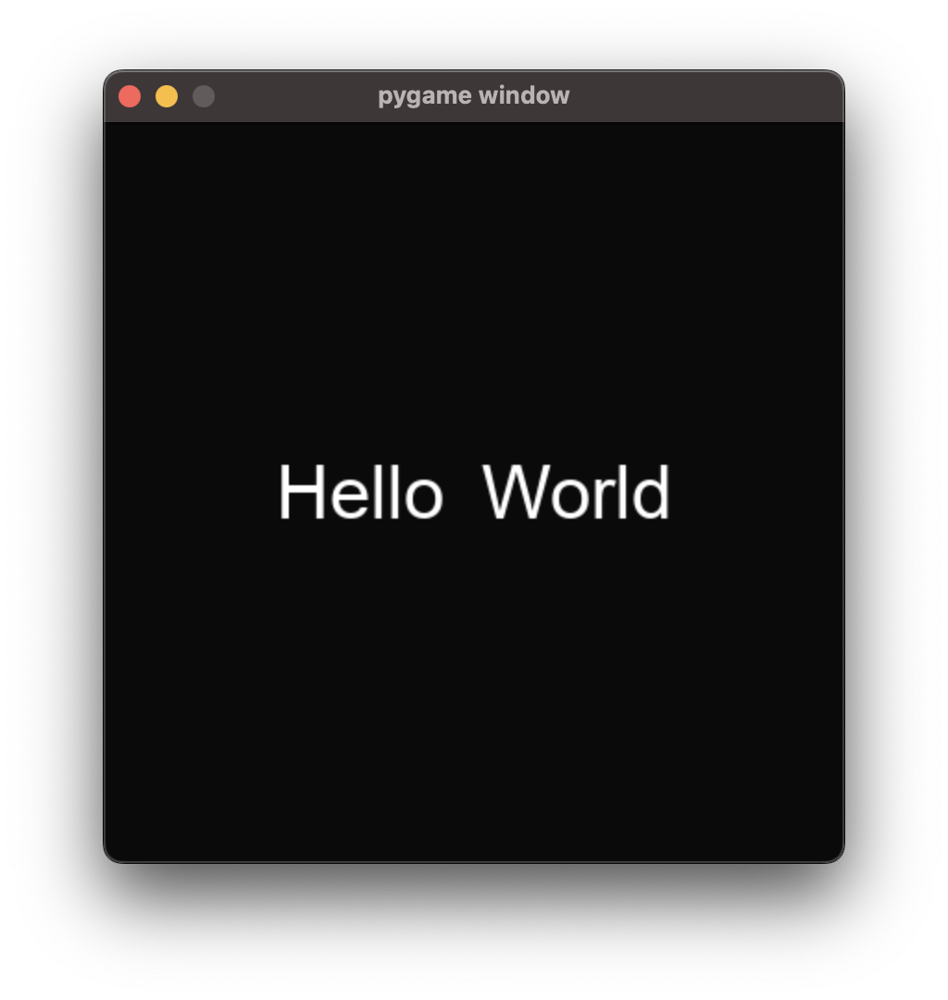
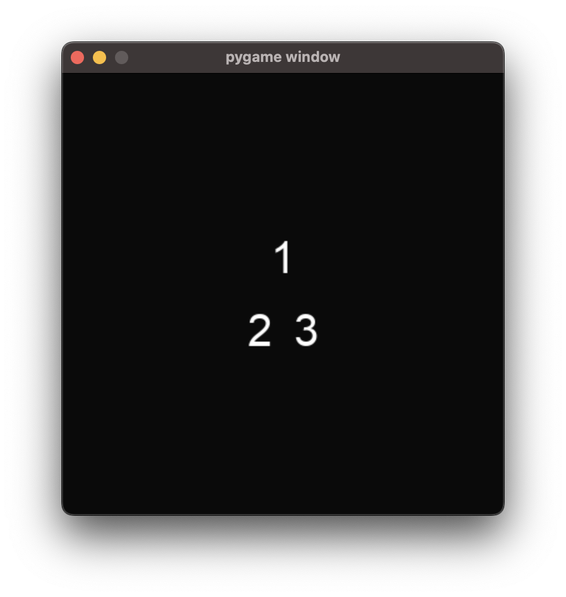
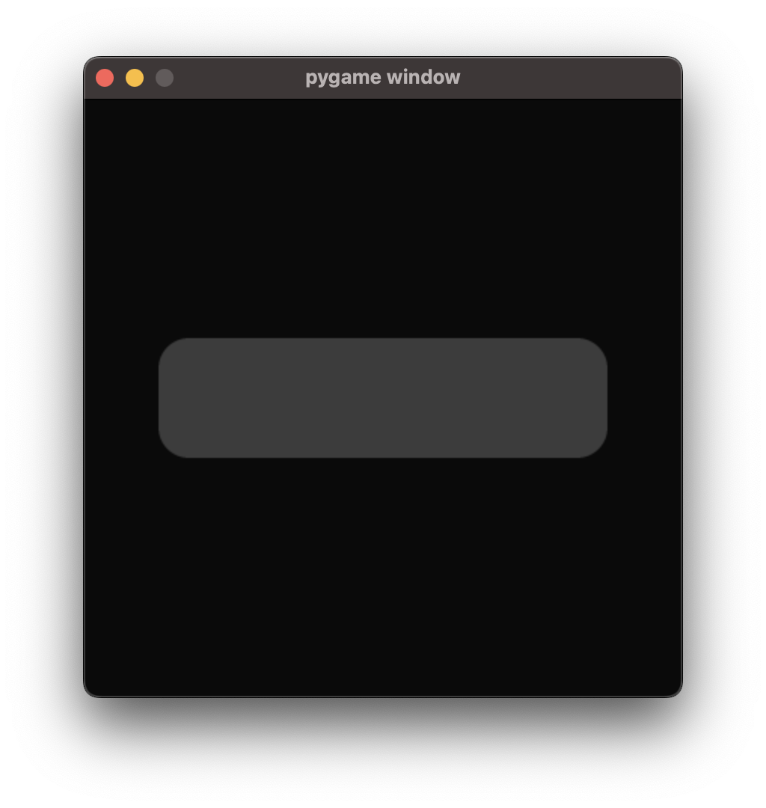
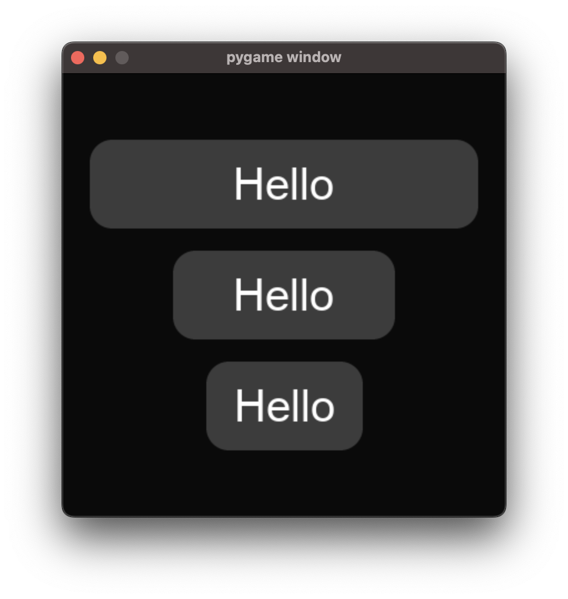
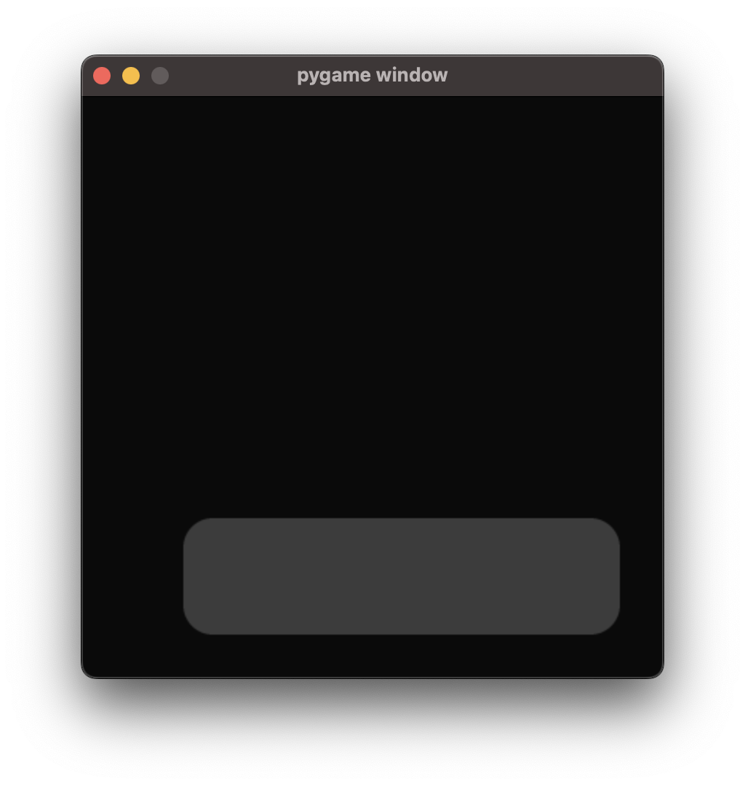

.. _element_guide:

Elements
===================================================

This page is an in-depth explanation of what Elements are and how you can use them to create menus.

**This page assumes a strong knowledge of Python (including OOP) and Pygame.**

.. _element-setup:

Basic Setup
------------------------
To do anything in Ember, you must first call these functions at the start of your project:

.. code-block:: python

    clock = pygame.time.Clock()
    ember.init(clock)
    ember.style.load("dark")

You must pass the clock that you will use to control your project framerate to :py:func:`ember.init()`. The first argument of :py:func:`ember.style.load()` controls what your UI will look like. You can load any style from the list of built-in styles listed below, or create your own custom style (we'll look at this later in the :ref:`Style Guide<style_guide>`).

Built-in styles:

- :code:`dark`
- :code:`pixel_dark`
- :code:`pixel_plastic`
- :code:`pixel_stone`

In addition to the steps described above, you must also call :code:`ember.update` each game tick where Ember is used.

Here's some sample code, with Ember-related lines highlighted:

.. code-block:: python
   :linenos:
   :emphasize-lines: 2,6,7,18

    import pygame
    import ember

    pygame.init()
    clock = pygame.time.Clock()
    ember.init(clock)
    ember.style.load("dark")

    screen = pygame.display.set_mode((400, 400))

    while True:
        for event in pygame.event.get():
            if event.type == pygame.QUIT:
                pygame.quit()
                exit()

        screen.fill("black")
        ember.update()

        clock.tick(60)
        pygame.display.flip()

.. _element-basics:
Creating a UI
------------------------

The term 'element' refers to a UI object such as a button or text field. There is a different class for each type of element. All element classes can be found under the :code:`ember.ui` module or straight from :code:`ember`, and all inherit from the base :py:class:`ember.ui.base.Element` class.

The most basic element is the :py:class:`ember.ui.Text` element. Given a string, it will render that string as text on the screen. To display an element on the screen, it must be contained within a :py:class:`ember.ui.View` object like this:

.. code-block:: python

    view = ember.View(
        ember.Text("Hello world")
    )

The View object is responsible for rendering the element that you pass to its constructor. In order for the View to do this, you must call :py:meth:`View.update<ember.ui.View.update>` each tick, and :py:meth:`View.event<ember.ui.View.event>` for each event in the Pygame event stack.

Below, I've added a View to the previous example script. The changes I've made are highlighted.

.. code-block:: python
   :linenos:
   :emphasize-lines: 11,12,13,17,24

    import pygame
    import ember

    pygame.init()
    clock = pygame.time.Clock()
    ember.init(clock)
    ember.style.load("dark")

    screen = pygame.display.set_mode((400, 400))

    view = ember.View(
        ember.Text("Hello world")
    )

    while True:
        for event in pygame.event.get():
            view.event(event)
            if event.type == pygame.QUIT:
                pygame.quit()
                exit()

        screen.fill("black")
        ember.update()
        view.update(screen)

        clock.tick(60)
        pygame.display.flip()

This code produces the following output:

.. image:: _static/element_guide/image1.png
  :width: 50%

.. _element-containers:
Multiple elements in a View
---------------------------------------------
A View can only hold **one** element at a time. If we want to display more than one element in a View, we have to wrap our elements in a **Container**. A 'container' is a type of element, the primary function of which is to arrange elements that are contained within it.

There are several different containers that you can use. The first one we'll look at is the :py:class:`VStack<ember.ui.VStack>` container. You can pass any number of elements to the VStack constructor, and they will be displayed in a vertical list on the screen when the View is rendered.

.. image:: _static/element_guide/image2.png
  :width: 160
  :align: right

.. code-block:: python

    view = ember.View(
        ember.VStack(
            ember.Text("Hello"),
            ember.Text("World")
        )
    )

Similarly, the :py:class:`HStack<ember.ui.HStack>` container displays elements in a horizontal list:

.. code-block:: python

    view = ember.View(
        ember.HStack(
            ember.Text("Hello"),
            ember.Text("World")
        )
    )

Remember, containers such as :code:`VStack` and :code:`HStack` are Elements just like :code:`Text` is. This means you can nest them inside of each other like this:

.. code-block:: python

    view = ember.View(
        ember.VStack(
            ember.Text("1"),
            ember.HStack(
                ember.Text("2"),
                ember.Text("3")
            )
        )
    )

There is no limit to how many times you can nest Views.

.. _element-buttons:
Buttons
------------------------

Lets look at our first **interactive** element - the :py:class:`Button<ember.ui.Button>`.

.. code-block:: python

    view = ember.View(
        ember.Button()
    )

Just like a container, you can pass any element to the Button constructor. This element will then be displayed on the surface of the button.

.. image:: _static/element_guide/image6.png
  :width: 160
  :align: right

.. code-block:: python

    view = ember.View(
        ember.Button(
            Text("Hello world")
        )
    )

For convenience, you can pass a string straight to the Button constructor and a Text element will be created for you.

.. code-block:: python

    # This code is equivalent to the previous example.
    view = ember.View(
        ember.Button("Hello world")
    )

When the user clicks the button, an :code:`ember.BUTTONCLICKED` event is emitted. You can listen for this event in the Pygame event stack just like you would with any Pygame event. The :code:`ember.BUTTONCLICKED` Event object has the following attributes:

- :code:`element` - The Button element that posted the event.
- :code:`text` - The text displayed on the element (a string) *if* the child of the Button is a Text object.

Example usage:

.. code-block:: python

    for event in pygame.event.get():
        if event.type == ember.BUTTONCLICKED:
            print(f"Button with text {event.text} was clicked!")

.. _element-sizing:
Element Sizing
------------------------
All elements have a size. You can change the size of an element using the :code:`size`, :code:`width` and :code:`height` parameters when you initialise the element.

 - The :code:`size` parameter accepts either a sequence of sizes or a single size. If you pass a sequence of sizes, the first and second items of the sequence will be used for the width and height of the element respectively. If you pass a single size, it will be used for *both* the width and height of the element.
 - The :code:`width` and :code:`height` parameters can be used to adjust the width and height of the element seperately, if you so wish. These parameters take priority over the :code:`size` parameter.

If no size is specified, default values will be used. The default values vary from element to element, and can differ depending on which style you load when calling :py:func:`ember.style.load()` at the start of your program.

Here is some example usage:

.. image:: _static/element_guide/image7.png
  :width: 160
  :align: right

.. code-block:: python

    # 100 pixels wide, and the default height.
    ember.Button(width=100)

    # 50 pixels high, and the default width.
    ember.Button(height=50)

    # 200 pixels wide and 50 pixels high.
    ember.Button(size=(200, 50))

    # 90 pixels wide and 90 pixels high.
    ember.Button(size=90)

There are other ways to describe size, too.

- You can pass :code:`ember.FILL` as a size value, and the element will **expand** to fill the maximum space available.

- You can pass :code:`ember.FIT` as a size value, and the element will **shrink** to fit the size of any child elements it may have.

.. image:: _static/element_guide/image8.png
  :width: 160
  :align: right

.. code-block:: python

    # The button expands to fill the available space on the x axis.
    ember.Button("Hello", width=ember.FILL)

    # The button shrinks on the x-axis to the width of its Text element.
    ember.Button("Hello", width=ember.FIT)

Both :code:`ember.FILL` and :code:`ember.FIT` support the :code:`+-*/` operators. This allows you to use them in more interesting ways, as shown below:

.. code-block:: python

    # The button's width is the maximum available space, minus 50 pixels.
    ember.Button("Hello", width=ember.FILL - 50)

    # The button's width is half of the maximum available space.
    ember.Button("Hello", width=ember.FILL / 2)

    # The button's width is the width of the text 'Hello', plus 50 pixels.
    ember.Button("Hello", width=ember.FIT + 50)

If you want to be able to see the size of a container more clearly, you can specify the :code:`material` parameter as shown below. We'll look at materials more later.

.. image:: _static/element_guide/image13.png
  :width: 160
  :align: right

.. code-block:: python

    ember.VStack(
        ember.Text("Hello world"),
        material=ember.material.Color("blue"),
        size=100
    )

.. _element-positioning:
Element Positioning
------------------------

For the containers we've looked at so far, the child elements' positions on the screen are handled by the container - we don't need to explicitly state the XY coordinates of the child elements. This is useful because it means that your UI can adapt to the size of the Pygame window.

The exception is the :py:class:`Layout<ember.ui.Layout>` container, which *does* allow you to specify absolute values if needed. You can do this by specifying the :code:`position` parameter when you construct the element:

.. image:: _static/element_guide/image10.png
  :width: 160
  :align: right

.. code-block:: python

    view = ember.View(
        ember.Layout(
            ember.Button(position=(70, 70)),
            ember.Button(position=(30, 250))
        )
    )

Alternatively, you can pass an **anchor** to the position parameter. Using an anchor will adapt the position of the element if the size of the Layout changes. For example:

.. image:: _static/element_guide/image11.png
  :width: 160
  :align: right

.. code-block:: python

    # Locked to the top-left
    ember.Button(position=(ember.TOP, ember.LEFT))

    # Locked to the right with a y position of 200
    ember.Button(position=(ember.RIGHT, 200))

These anchors support the :code:`+-` operators, meaning that you can add padding like this:

.. code-block:: python

    # 30 pixels from the bottom-right on both the x and y axes
    ember.Button(position=(ember.RIGHT-30, ember.BOTTOM-30))

Here are the anchors that you can use:

- :code:`LEFT`
- :code:`RIGHT`
- :code:`TOP`
- :code:`BOTTOM`
- :code:`CENTER`

Additionally, there are a number of predefined **anchor tuples** for your convenience:

.. code-block:: python

    # Instead of writing:
    ember.Button(position=(ember.TOP, ember.LEFT))
    # You can write:
    ember.Button(position=ember.TOPLEFT)

- :code:`TOPLEFT`
- :code:`TOPRIGHT`
- :code:`BOTTOMLEFT`
- :code:`BOTTOMRIGHT`
- :code:`MIDLEFT`
- :code:`MIDRIGHT`
- :code:`MIDTOP`
- :code:`MIDBOTTOM`

.. _element-list:
Elements List
------------------------

Congratulations! You've learnt the basics of Ember. Now would be a good time to experiment with what you've learned so far, if you haven't already!

Below, you can find brief descriptions of some other elements in Ember. Each element has parameters, attributes and methods that you can use to customise them. To see a full list of these, click on the Element name.

:py:class:`Text<ember.ui.Text>`
.....................................

.. image:: _static/element_guide/text1.png
  :width: 160
  :align: right

By default, Text elements use a :code:`FIT` width. If we change this to :code:`FILL`, the text wraps nicely onto the
next line.

.. code-block:: python

    ember.VStack(
        ember.Text(
            "velit excepteur anim anim et aute laborum sit ut consectetur",
            color="cyan",
            width=ember.FILL,
            align="left"
        ),
        ember.Text(
            "sunt aliqua voluptate consequat ad eu tempor incididunt sit culpa",
            color="yellow",
            width=ember.FILL,
            align="right"
        )
    )

:py:class:`Surface<ember.ui.Surface>`
.....................................

Wraps a Pygame Surface for use as an Element.

.. code-block:: python

    image = pygame.image.load("image.png").convert()
    ember.Surface(image)

:py:class:`VStack<ember.ui.VStack>` / :py:class:`HStack<ember.ui.HStack>`
............................................................................

.. image:: _static/element_guide/stack1.png
  :width: 160
  :align: right

Used to arrange elements vertically or horizontally.

.. code-block:: python

    ember.VStack(
        ember.Button(width=ember.FILL),
        ember.HStack(
            ember.Button(width=ember.FILL),
            ember.Button(width=ember.FILL)
        ),
        width=ember.FILL - 50,
        spacing=50,
    )

:py:class:`Layout<ember.ui.Layout>`
.....................................

.. image:: _static/element_guide/image10.png
  :width: 160
  :align: right

A container that allows explicit positioning of elements. See the section on :ref:`element-positioning` for a reminder on how to do this.

.. code-block:: python

    view = ember.View(
        ember.Layout(
            ember.Button(position=(70, 70)),
            ember.Button(position=(30, 250))
        )
    )

:py:class:`VScroll<ember.ui.VScroll>` / :py:class:`HScroll<ember.ui.HScroll>`
.....................................

.. image:: _static/element_guide/scroll1.png
  :width: 160
  :align: right

Holds a single element and allows you to scroll through that element using the mouse wheel.

.. code-block:: python

    ember.VScroll(
        ember.VStack(
            [ember.Button(str(i)) for i in range(20)]
        ),
        size = ember.FILL-50
    )

:py:class:`Spacer<ember.ui.Spacer>`
.......................................

.. image:: _static/element_guide/spacer1.png
  :width: 160
  :align: right

A blank element used to control spacing between elements in containers.

.. code-block:: python

    ember.VStack(
        ember.Button("1"),
        ember.Button("2"),
        ember.Spacer(height=50),
        ember.Button("3")
    )

:py:class:`Button<ember.ui.Button>`
.......................................

.. image:: _static/element_guide/button1.png
  :width: 160
  :align: right

Can hold one element, which is displayed on the surface of button.

.. code-block:: python

    ember.Button(
        ember.VStack(
            ember.Text("Hello"),
            ember.Text("World")
        ),
        height=ember.FIT + 30
    )

If you pass a string instead of an element, a Text element is made for you. If you pass more than one element to the Button, they get wrapped with a HStack.

When the user clicks the button, an :code:`ember.BUTTONCLICKED` event is emitted. The Event object has the following attributes:

- :code:`element` - The Button element that posted the event.
- :code:`text` - The text displayed on the element (a string) *if* the child of the Button is a Text object.

:py:class:`Toggle<ember.ui.Toggle>`
.......................................

.. image:: _static/element_guide/toggle1.png
  :width: 160
  :align: right

A switch that is either on or off.

.. code-block:: python

    ember.VStack(
        ember.Toggle(False),
        ember.Toggle(True)
    )

When toggled, an :code:`ember.TOGGLECLICKED` event is emitted. The Event object has the following attributes:

 - :code:`element` - The Toggle element that posted the event.
 - :code:`is_active` - Whether the toggle is on or off.

:py:class:`Slider<ember.ui.Slider>`
.......................................

.. image:: _static/element_guide/slider1.png
  :width: 160
  :align: right

Allows the user to select a value in a given range. The Slider's value can be read by accessing the :code:`value` property of the Slider.

.. code-block:: python

    ember.Slider(
        ember.Slider(
            min_value = 1,
            max_value = 10
        ),
    )

When the Slider is moved, an :code:`ember.SLIDERMOVED` event is emitted. The Event object has the following attributes:

 - :code:`element` - The Slider element that posted the event.
 - :code:`value` - The new value of the Slider.

:py:class:`TextField<ember.ui.TextField>`
.......................................

.. image:: _static/element_guide/text_field1.png
  :width: 160
  :align: right

A text input. Set :code:`multiline = True` to make the text render on more than one line.

.. code-block:: python

    ember.TextField("")

When the contexts of the TextField are modified, an :code:`ember.TEXTFIELDMODIFIED` event is emitted. When the TextField is closed, an :code:`ember.TEXTFIELDCLOSED` event is emitted. Both the Event objects have the following attributes:

 - :code:`element` - The TextField element that posted the event.
 - :code:`text` - The text string.