.. _element_guide:

Elements
===================================================

This page is an in-depth explanation of what Elements are and how you can use them to create menus.

**This page assumes a strong knowledge of Python (including OOP) and Pygame.**

.. _element-setup:

Basic Setup
------------------------
To do anything in Ember, you must first call these functions at the start of your project:

.. code-block:: python

    ember.init()
    ember.style.load("dark")

    # Where 'clock' is your pygame.Clock object
    ember.set_clock(clock)

:py:func:`ember.style.load()` loads a 'style' for your project. This controls what your UI will look like. The first argument of the function is the name of the style you want to load - you can use any style from the built-in styles listed below below, or create your own custom style (we'll look at this later in the :ref:`Style Guide<style_guide>`).

Built-in styles:

- :code:`dark`
- :code:`pixel_dark`
- :code:`pixel_plastic`
- :code:`pixel_stone`

In addition to the steps described above, you must also call :code:`ember.update` for each game tick where Ember is used.

Here's some sample code, with Ember-related lines highlighted:

.. code-block:: python
   :linenos:
   :emphasize-lines: 2,9,10,11,21

    import pygame
    import ember

    pygame.init()
    clock = pygame.time.Clock()

    screen = pygame.display.set_mode((400, 400))

    ember.init()
    ember.style.load("dark")
    ember.set_clock(clock)

    running = True
    while running:
        for event in pygame.event.get():
            if event.type == pygame.QUIT:
                running = False

        screen.fill("black")
        ember.update()

        clock.tick(60)
        pygame.display.flip()
    pygame.quit()

This code produces a black screen. Next, we'll look at adding some UI elements to the screen.

.. _element-basics:
Creating a UI
------------------------

The term 'element' refers to a UI object such as a button or text field. There is a different class for each type of element in Ember. All element classes can be found under the :code:`ember.ui` module or straight from :code:`ember`.

First, we’ll look at the :py:class:`ember.ui.Text` element. Given a string, it will render that string as text on the screen.

.. code-block:: python

    text = ember.Text("Hello world")

Next, we'll need to create a :py:class:`ember.ui.View` object. A View can hold an element inside of it, and becomes responsible for managing the rendering of that element. Let's create a View to hold our Text element.

.. code-block:: python

    text = ember.Text("Hello world")
    view = ember.View(text)

In order for the View to render it's child element on the screen, you must call :py:meth:`View.update<ember.ui.View.update>` each tick, and :py:meth:`View.event<ember.ui.View.event>` for each event in the Pygame event stack.

I've added a View to the previous example script. The changes I've made are highlighted.

.. code-block:: python
   :linenos:
   :emphasize-lines: 13,14,15,20,26

    import pygame
    import ember

    pygame.init()
    clock = pygame.time.Clock()

    screen = pygame.display.set_mode((400, 400))

    ember.init()
    ember.style.load("dark")
    ember.set_clock(clock)

    view = ember.View(
        ember.Text("Hello world")
    )

    running = True
    while True:
        for event in pygame.event.get():
            view.event(event)
            if event.type == pygame.QUIT:
                running = False

        screen.fill("black")
        ember.update()
        view.update(screen)

        clock.tick(60)
        pygame.display.flip()
    pygame.quit()

This code produces the following output:

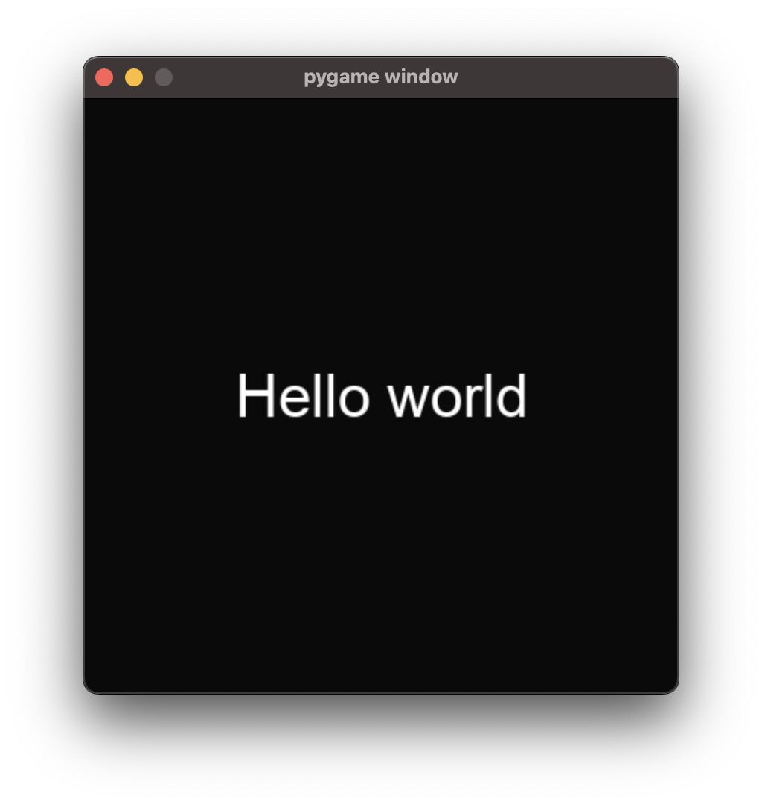

.. _element-containers:
Multiple elements in a View
---------------------------------------------
A View can only hold **one** element at a time. If we want to display more than one element in a View, we have to wrap our elements in a **Container**. A 'container' is a type of element that can hold other elements inside of it.

There are several different containers that you can use. Each type of container arranges its child elements in a different way.

The first container we'll look at is the :py:class:`VStack<ember.ui.VStack>` container. You can pass any number of elements to the VStack constructor, and they will be displayed in a vertical list on the screen when the View is rendered.

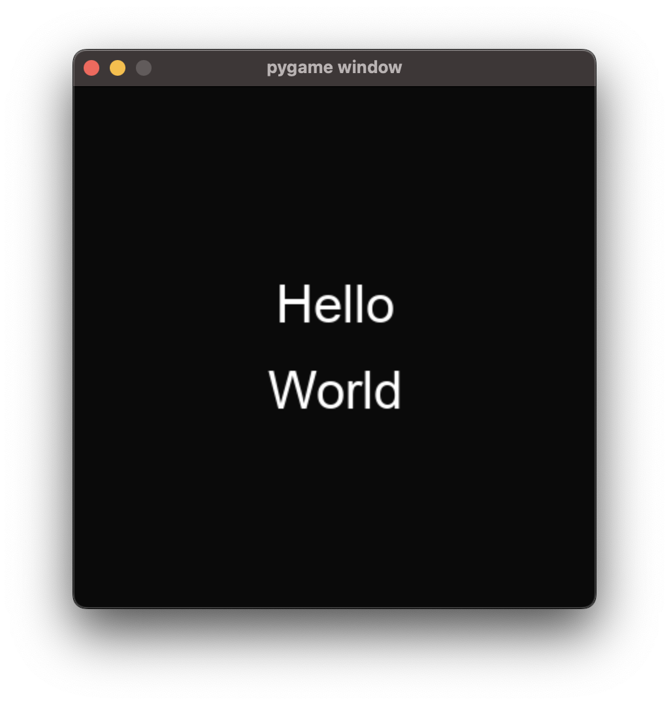

.. code-block:: python

    view = ember.View(
        ember.VStack(
            ember.Text("Hello"),
            ember.Text("World")
        )
    )

Similarly, the :py:class:`HStack<ember.ui.HStack>` container displays elements in a horizontal list:

.. image:: _static/element_guide/hstack.png
  :width: 160
  :align: right

.. code-block:: python

    view = ember.View(
        ember.HStack(
            ember.Text("Hello"),
            ember.Text("World")
        )
    )

Remember, containers such as :code:`VStack` and :code:`HStack` are Elements just like :code:`Text` is. This means you can nest them inside of each other like this:

.. image:: _static/element_guide/nested_container.png
  :width: 160
  :align: right

.. code-block:: python

    view = ember.View(
        ember.VStack(
            ember.Text("1"),
            ember.HStack(
                ember.Text("2"),
                ember.Text("3")
            )
        )
    )

There is no limit to how many times you can nest Containers in this way.

.. _element-buttons:
Buttons
------------------------

.. image:: _static/element_guide/button1.png
  :width: 160
  :align: right

Lets look at our first interactive element - the :py:class:`Button<ember.ui.Button>`.

.. code-block:: python

    view = ember.View(
        ember.Button()
    )

The Button is a container that can hold a single element, as shown below.

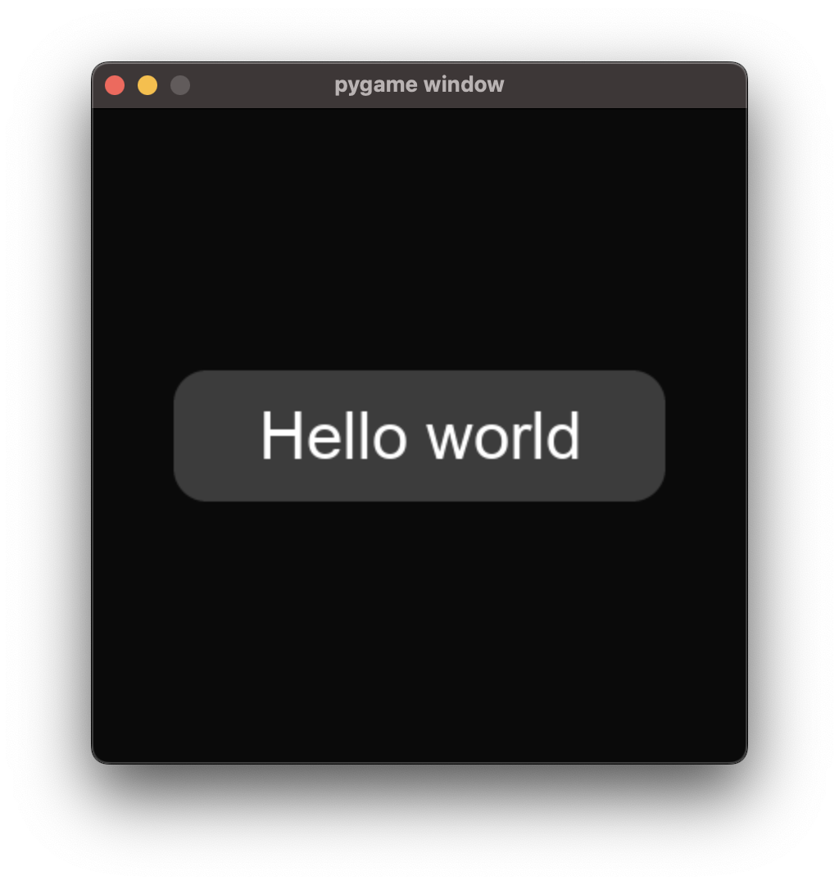

.. code-block:: python

    view = ember.View(
        ember.Button(
            Text("Hello world")
        )
    )

For convenience, you can pass a string straight to the Button constructor and a Text element will be created for you.

.. code-block:: python

    # This code is equivalent to the previous example.
    view = ember.View(
        ember.Button("Hello world")
    )

When the user clicks the Button, an :code:`ember.BUTTONCLICKED` event is emitted. You can listen for this event in the Pygame event stack just like you would with any Pygame event. The :code:`ember.BUTTONCLICKED` Event object has the following attributes:

- :code:`element` - The Button element that posted the event.
- :code:`text` - The text displayed on the element (a string) *if* the child of the Button is a Text object.

Example usage:

.. code-block:: python

    for event in pygame.event.get():
        if event.type == ember.BUTTONCLICKED:
            print(f"Button with text {event.text} was clicked!")

More syntax
-----------------------------------

Let's return to the VStack example code we looked at earlier.

.. code-block:: python

    view = ember.View(
        ember.VStack(
            ember.Text("Hello"),
            ember.Text("World")
        )
    )

In this example, we attribute two Text elements to the VStack container by passing them directly to the VStack constructor.
If we want to keep references to our elements, we can save them to variables and pass those variables to the VStack instead.

.. code-block:: python

    text1 = ember.Text("Hello")
    text2 = ember.Text("World")

    view = ember.View(
        ember.VStack(text1, text2)
    )

Keeping references to our Text elements allows us to modify them later in our program. For example, you can call the :py:meth:`Text.set_text<ember.ui.Text.set_text>` method anywhere in your code to modify the element's text string, or the :py:meth:`Text.set_color<ember.ui.Text.set_color>` method to modify its color.

.. code-block:: python

    text1.set_text("Goodbye")
    text1.set_color("red")

There are several ways that we can modify the contents of our VStack. The :py:meth:`set_elements<ember.ui.base.MultiElementContainer.set_elements>` method can be used to replace all of the elements in the stack at once. Additionally, Containers such as VStack support list-like methods such as :py:meth:`append<ember.ui.base.MultiElementContainer.append>`, :py:meth:`pop<ember.ui.base.MultiElementContainer.pop>`, :py:meth:`remove<ember.ui.base.MultiElementContainer.remove>` and :py:meth:`index<ember.ui.base.MultiElementContainer.index>`.

Below is an example of how the :py:meth:`append<ember.ui.base.MultiElementContainer.append>` method can be used to add elements to a VStack:

.. code-block:: python

    stack = ember.VStack()
    stack.append(ember.Text("Hello"))
    stack.append(ember.Text("World"))

    view = ember.View(stack)

Another way of attributing elements to a container is through the use of the :code:`with` keyword. Any elements instantiated within
the context of a container will be appended to that container when the :code:`with` statement finishes, if they aren't yet contained within another element by that point. For example, the code we've just looked at can be rewritten like so:

.. code-block:: python

    with ember.VStack() as stack:
        ember.Text("Hello")
        ember.Text("World")

    view = ember.View(stack)

Container contexts can be nested, and it works with View too.

.. code-block:: python

    with ember.View() as view:
        with ember.VStack():
            ember.Text("1")
            with ember.HStack():
                ember.Text("2")
                ember.Text("3")

This alternative way of constructing menus is often much more convenient than nesting element constructors, because you can run additional code (such as keeping a reference to an element as a variable) whilst creating your menu.

.. _element-challenge:

Challenge
------------------------

Now is a good time to experiment with what you've learnt so far. Below is a simple challenge that you may wish to follow.

You'll be creating a simple clicker game. Your objectives are:

- Display a Button with the text 'click me'.
- Above the button, display a Text element with the value :code:`0`. This will be our counter.
- When the button is clicked, the value displayed on the Text element should be incremented by 1.

You are of course free to look at any of the example code above whilst designing your solution. Here's what the finished
product should look like:

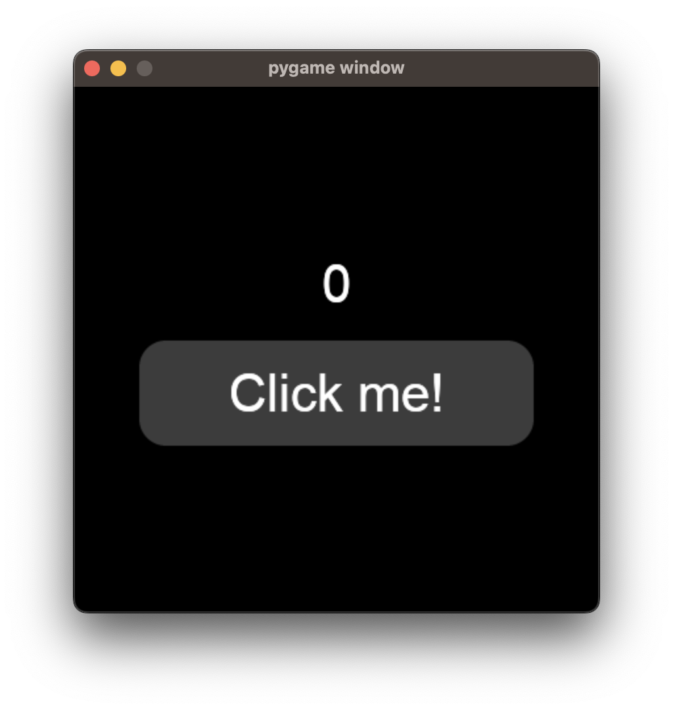

.. dropdown:: Reveal Solution

    .. code-block:: python

        import pygame
        import ember

        pygame.init()
        clock = pygame.time.Clock()

        screen = pygame.display.set_mode((400, 400))

        ember.init()
        ember.style.load("dark")
        ember.set_clock(clock)

        counter = 0
        text = ember.Text("0")
        button = ember.Button("Click me!")

        view = ember.View(
            ember.VStack(
                text,
                button
            )
        )

        running = True
        while running:
            for event in pygame.event.get():
                view.event(event)
                if event.type == pygame.QUIT:
                    running = False

                elif event.type == ember.BUTTONCLICKED:
                    counter += 1
                    text.set_text(str(counter))

            screen.fill("black")
            ember.update()
            view.update(screen)

            clock.tick(60)
            pygame.display.flip()
        pygame.quit()

.. _element-sizing:

Element Sizing
------------------------

Size Parameters
.....................

All elements have a size. You can change the size of an element using the :code:`size`, :code:`w` and :code:`h` parameters when you initialise the element.

 - The :code:`size` parameter accepts either a sequence of sizes or a single size. If you pass a sequence of sizes, the first and second items of the sequence will be used for the width and height of the element respectively. If you pass a single size, it will be used for *both* the width and height of the element.
 - The :code:`w` and :code:`h` parameters can be used to adjust the width and height of the element seperately, if you so wish. These parameters take priority over the :code:`size` parameter.

If no size is specified, default values will be used. The default values vary from element to element, and can differ depending on which style you load when calling :py:func:`ember.style.load()` at the start of your program.

Here is some example usage:

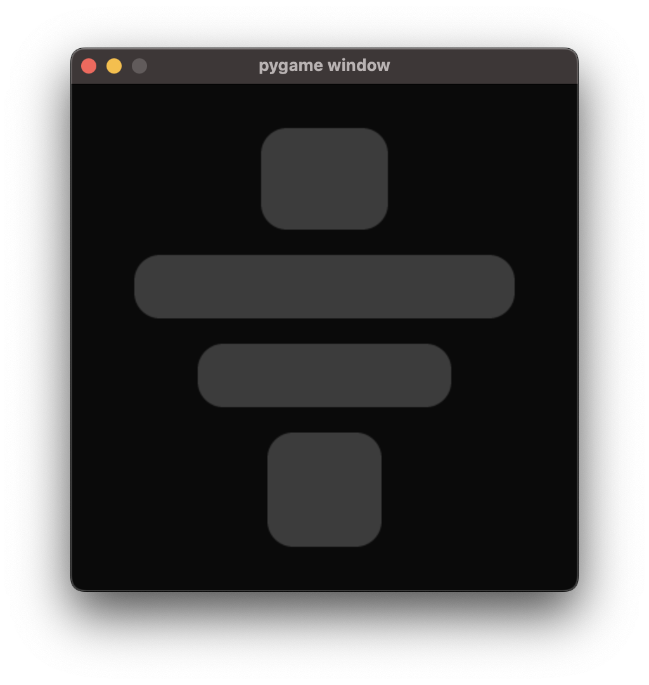

.. code-block:: python

    # 100 pixels wide, and the default height.
    ember.Button(w=100)

    # 50 pixels high, and the default width.
    ember.Button(h=50)

    # 200 pixels wide and 50 pixels high.
    ember.Button(size=(200, 50))

    # 90 pixels wide and 90 pixels high.
    ember.Button(size=90)

.. note::

    .. image:: _static/element_guide/material.png
          :width: 160
          :align: right

    If you want to be able to see the size of a VStack or HStack more clearly while experimenting with sizes, you can specify the :code:`material` parameter as shown below. This will fill the container background with a solid color. We'll look at materials more later.

    .. code-block:: python

        ember.VStack(
            ember.Text("Hello world"),
            material=ember.material.Color("blue"),
            size=100
        )

FIT and FILL
..................

There are other ways to describe size, too.

- You can pass :code:`ember.FILL` as a size value, and the element will **expand** to the maximum size available.

- You can pass :code:`ember.FIT` as a size value, and the element will **shrink** to the minimum size available.

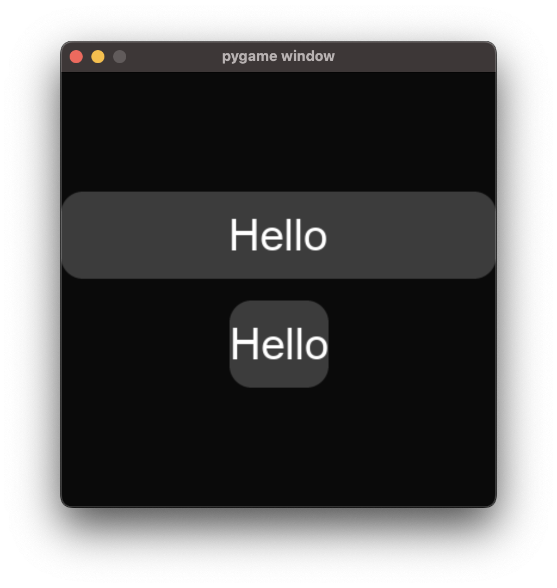

.. code-block:: python

    # The button expands to fill the available space on the x-axis.
    ember.Button("Hello", w=ember.FILL)

    # The button shrinks on the x-axis to the width of its Text element.
    ember.Button("Hello", w=ember.FIT)

Both :code:`ember.FILL` and :code:`ember.FIT` support the :code:`+-*/` operators, as described below.

.. image:: _static/element_guide/size3.png
  :width: 160
  :align: right

.. code-block:: python

    # The button's width is the maximum available space, minus 50 pixels.
    ember.Button("Hello", w=ember.FILL - 50)

    # The button's width is half of the maximum available space.
    ember.Button("Hello", w=ember.FILL / 2)

    # The button's width is the width of the text 'Hello', plus 50 pixels.
    ember.Button("Hello", w=ember.FIT + 50)

Content sizes
..................

Some containers offer :code:`content_size`, :code:`content_w` and :code:`content_h` parameters. You can specify sizes for these parameters just like you would for the :code:`size`, :code:`w` and :code:`h` parameters. When you do this, the size will be applied to every child of the container.

In this example, every Button in the VStack will have a width of 50px.

.. code-block:: python

    with ember.VStack(content_w=50):
        ember.Button("A")
        ember.Button("B")
        ember.Button("C")

.. _element-positioning:
Element Positioning
------------------------

Position Parameters
.........................

In addition to changing the size of an element, we can change its position relative to its parent element. All elements have :code:`pos`,
:code:`x` and :code:`y` parameters, which work in a similar way to :code:`size`, :code:`w` and :code:`h`.

Let's look at an example. By default, the VStack container will align its child elements to the center of the VStack. We can change this behaviour by specifying an :code:`x` position for one of the VStack's child elements. Specifying an integer for this parameter will position the element that number of pixels from the left edge of the VStack.

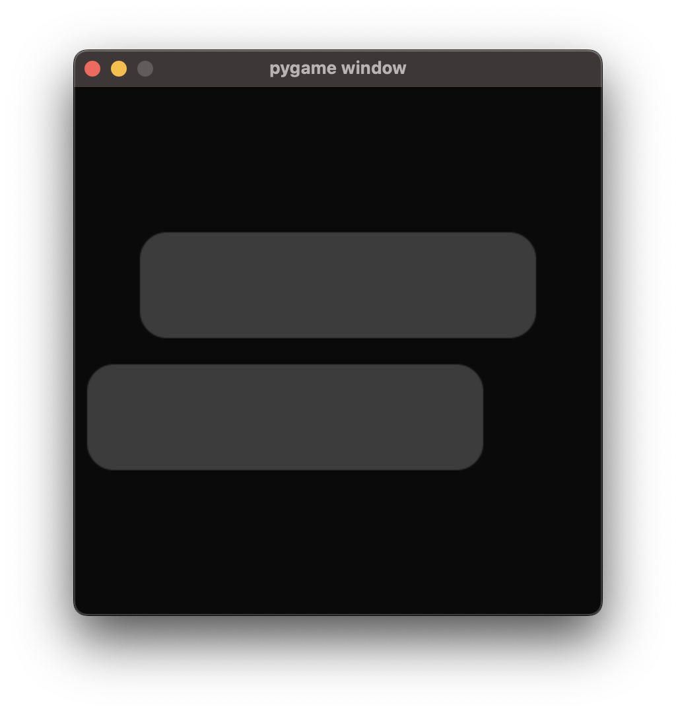

.. code-block:: python

    view = ember.View(
        ember.VStack(
            ember.Button(),
            ember.Button(x=20),
            w=ember.FILL
        )
    )

Layouts
............

A VStack container only lets you adjust the :code:`x` position of an element, because the vertical positioning of the elements is dictated by the container itself. Similarly, the elements within a HStack container only respect the :code:`y` parameter.

The :py:class:`Layout<ember.ui.Layout>` container repects *both* the :code:`x` and :code:`y` positions of its child elements, which allows for more explicit positioning.

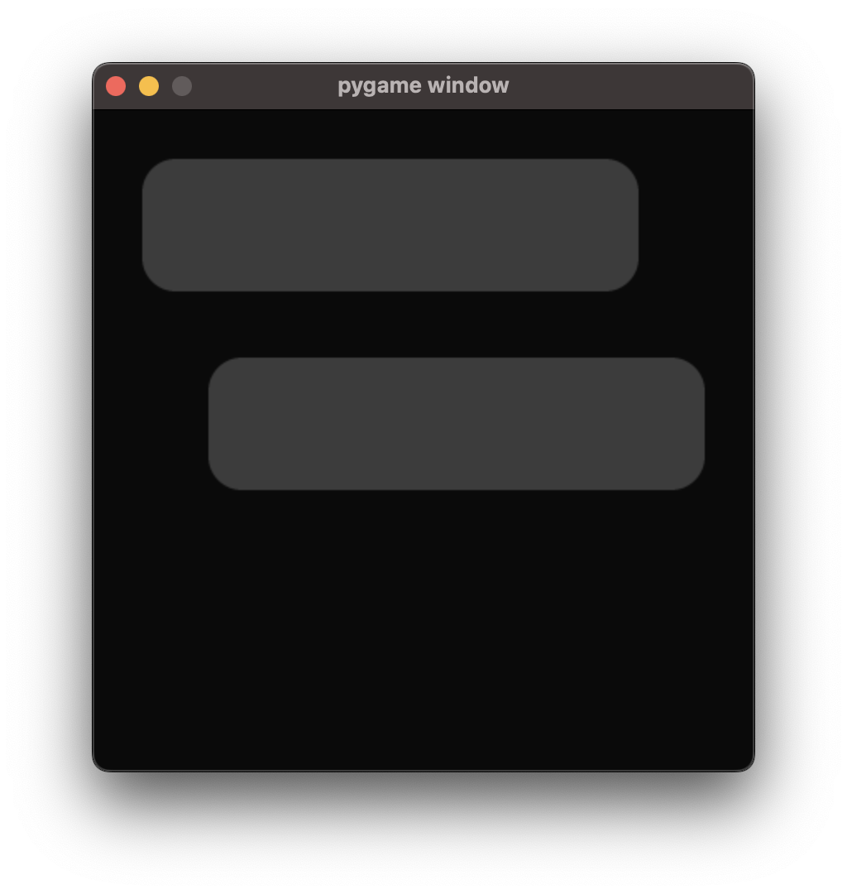

.. code-block:: python

    ember.Layout(
        ember.Button(x=30, y=30),
        ember.Button(pos=(70, 150))
    )

Anchors
.............

As an alternative to passing integers as position arguments, you can use **anchors** instead. Consider this example:

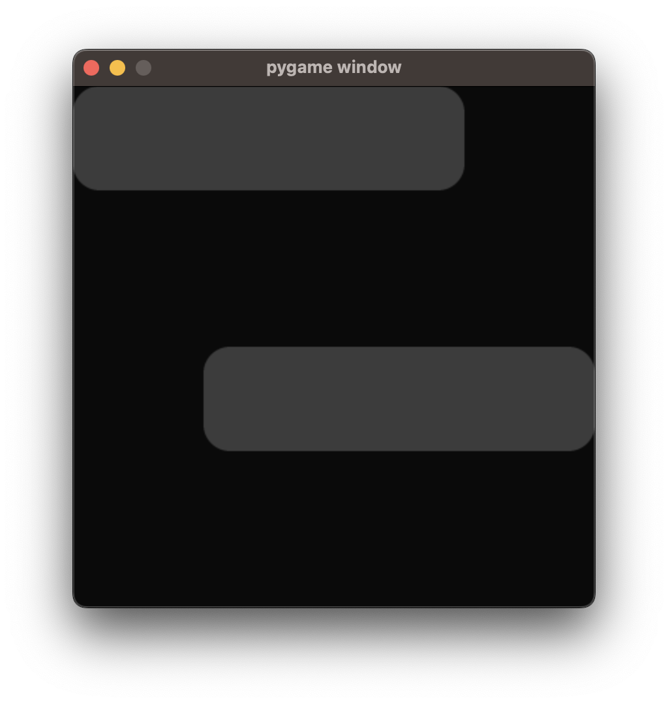

.. code-block:: python

    ember.Layout(
        # Anchored to the top-left of the container
        ember.Button(x=(ember.TOP, ember.LEFT))

        # Anchored to the right, with a y position of 200
        ember.Button(pos=(ember.RIGHT, 200))
    )

These anchors support the :code:`+-` operators, meaning that you can add padding like this:

.. image:: _static/element_guide/pos3.png
  :width: 160
  :align: right

.. code-block:: python

    # 30 pixels from the bottom-right on both the x and y axes
    ember.Layout(
        ember.Button(pos=(ember.RIGHT-30, ember.BOTTOM-30))
    )

Here are the anchors that you can use:

- :code:`LEFT`
- :code:`RIGHT`
- :code:`TOP`
- :code:`BOTTOM`
- :code:`CENTER`

Additionally, there are a number of predefined **anchor tuples** for your convenience:

.. code-block:: python

    # Instead of writing:
    ember.Button(pos=(ember.TOP, ember.LEFT))
    # You can write:
    ember.Button(pos=ember.TOPLEFT)

- :code:`TOPLEFT`
- :code:`TOPRIGHT`
- :code:`BOTTOMLEFT`
- :code:`BOTTOMRIGHT`
- :code:`MIDLEFT`
- :code:`MIDRIGHT`
- :code:`MIDTOP`
- :code:`MIDBOTTOM`

Content positions
....................

Similarly to how the size of elements in a container can be specified with the :code:`content_size`, :code:`content_w` and :code:`content_h` parameters, you can specify the position of elements in a container using the :code:`content_pos`, :code:`content_x` and :code:`content_y` parameters.

In this example, every Button in the VStack will be anchored to the right edge of the VStack.

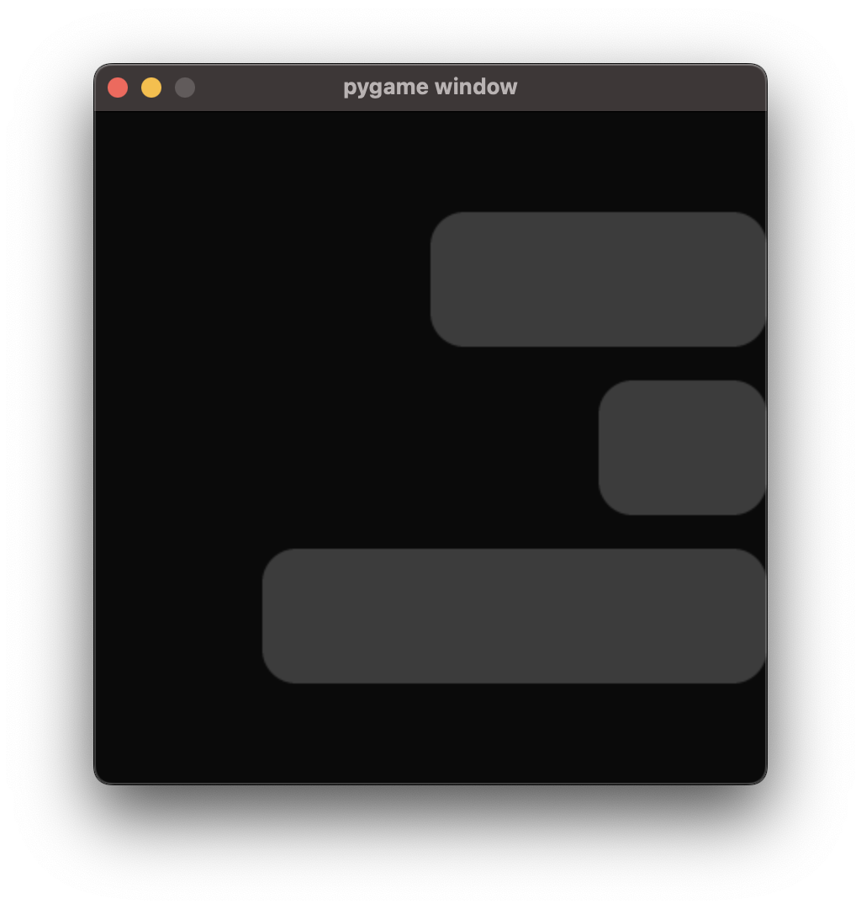

.. code-block:: python

    ember.VStack(
        ember.Button(w=200),
        ember.Button(w=100),
        ember.Button(w=300),
        content_x=ember.RIGHT,
        w=ember.FILL
    )

.. _element-list:
Elements List
------------------------

Congratulations! You've learnt the basics of Ember. Now would be a good time to experiment with what you've learned so far, if you haven't already!

Below, you can find brief descriptions of some other elements in Ember. Each element has parameters, attributes and methods that you can use to customise their appearance and behaviour. To see a full list of these, click on the Element name.

:py:class:`Text<ember.ui.Text>`
.....................................

.. image:: _static/element_guide/text1.png
  :width: 160
  :align: right

By default, Text elements use a :code:`FIT` width. If we change this to :code:`FILL`, the text wraps nicely onto the
next line.

.. code-block:: python

    ember.VStack(
        ember.Text(
            "velit excepteur anim anim et aute laborum sit ut consectetur",
            color="cyan",
            w=ember.FILL,
            align="left"
        ),
        ember.Text(
            "sunt aliqua voluptate consequat ad eu tempor incididunt sit culpa",
            color="yellow",
            w=ember.FILL,
            align="right"
        )
    )

:py:class:`Surface<ember.ui.Surface>`
.....................................

Wraps a Pygame Surface for use as an Element.

.. code-block:: python

    image = pygame.image.load("image.png").convert()
    ember.Surface(image)

:py:class:`VStack<ember.ui.VStack>` / :py:class:`HStack<ember.ui.HStack>`
............................................................................

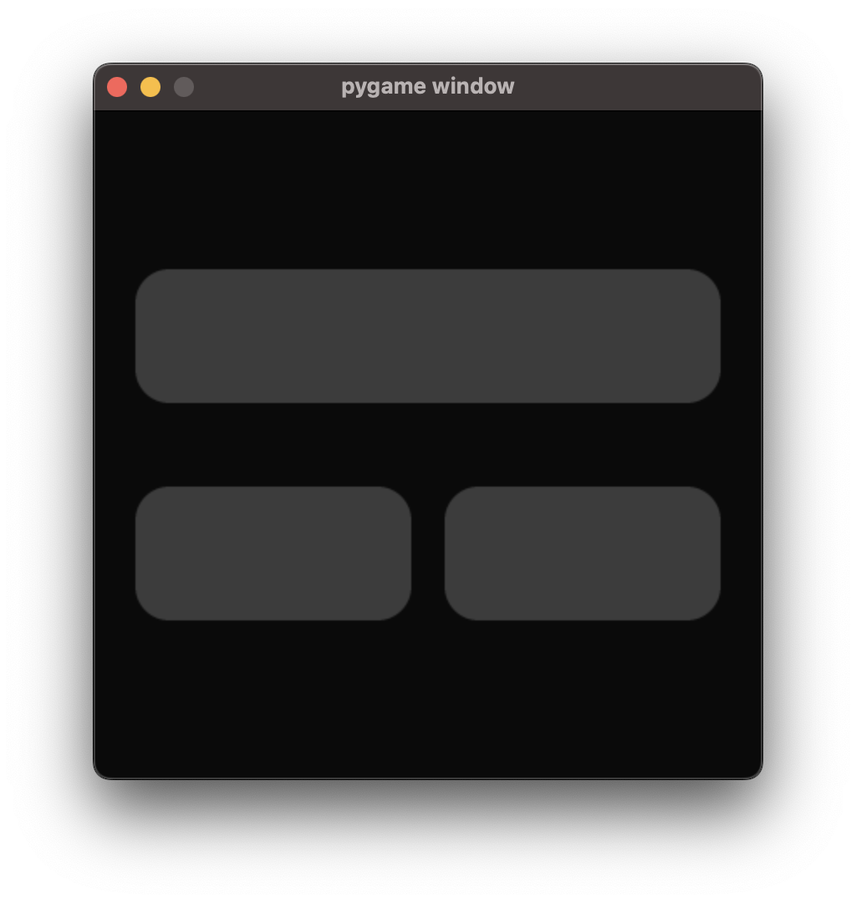

Used to arrange elements vertically or horizontally.

.. code-block:: python

    ember.VStack(
        ember.Button(w=ember.FILL),
        ember.HStack(
            ember.Button(w=ember.FILL),
            ember.Button(w=ember.FILL)
        ),
        w=ember.FILL - 50,
        spacing=50,
    )

:py:class:`Layout<ember.ui.Layout>`
.....................................

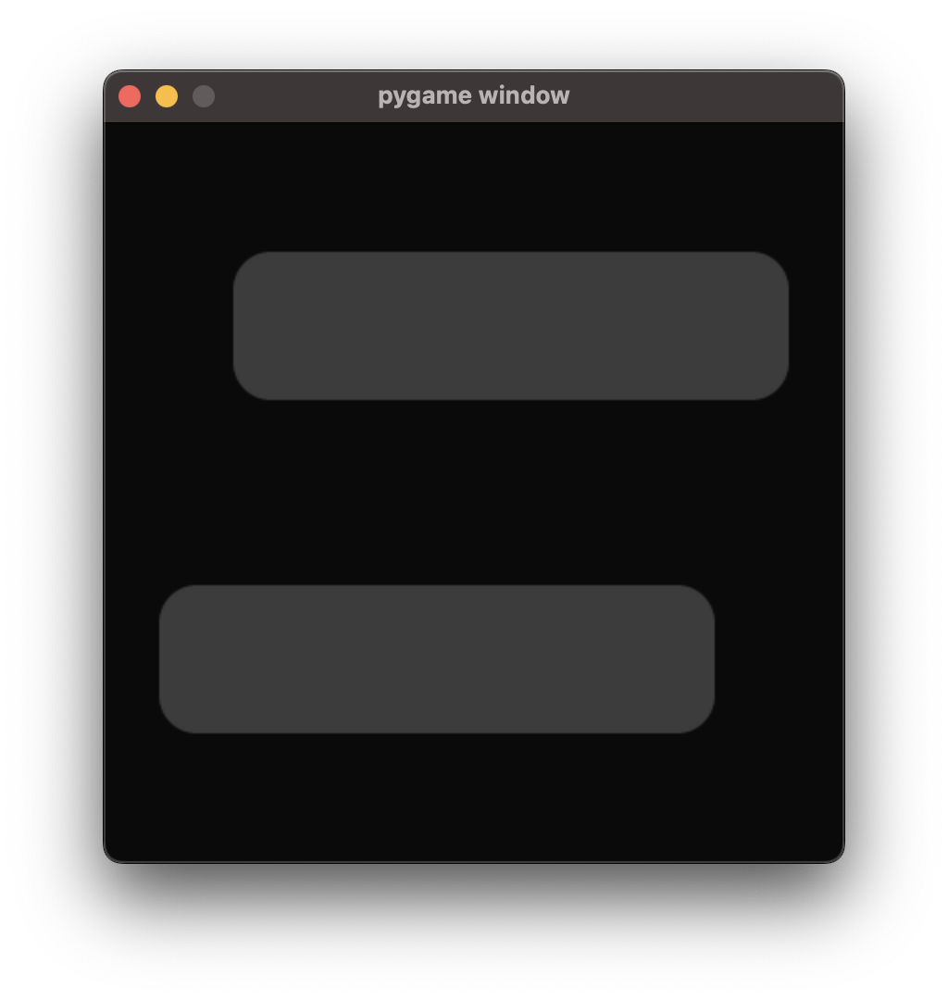

A container that allows explicit positioning of elements. See the section on :ref:`element-positioning` for a reminder on how to do this.

.. code-block:: python

    view = ember.View(
        ember.Layout(
            ember.Button(pos=(70, 70)),
            ember.Button(pos=(30, 250))
        )
    )

:py:class:`VScroll<ember.ui.VScroll>` / :py:class:`HScroll<ember.ui.HScroll>`
.....................................

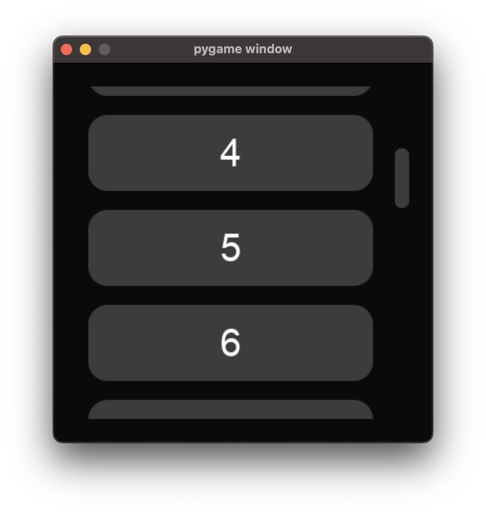

Holds a single element and allows you to scroll through that element using the mouse wheel.

.. code-block:: python

    ember.VScroll(
        ember.VStack(
            [ember.Button(str(i)) for i in range(20)]
        ),
        size = ember.FILL-50
    )

:py:class:`Spacer<ember.ui.Spacer>`
.......................................

.. image:: _static/element_guide/spacer1.png
  :width: 160
  :align: right

A blank element used to control spacing between elements in containers.

.. code-block:: python

    ember.VStack(
        ember.Button("1"),
        ember.Button("2"),
        ember.Spacer(h=50),
        ember.Button("3")
    )

:py:class:`Button<ember.ui.Button>`
.......................................

.. image:: _static/element_guide/button1.png
  :width: 160
  :align: right

Can hold one element, which is displayed on the surface of button.

.. code-block:: python

    ember.Button(
        ember.VStack(
            ember.Text("Hello"),
            ember.Text("World")
        ),
        h=ember.FIT + 30
    )

If you pass a string instead of an element, a Text element is made for you. If you pass more than one element to the Button, they get wrapped with a HStack.

When the user clicks the button, an :code:`ember.BUTTONCLICKED` event is emitted. The Event object has the following attributes:

- :code:`element` - The Button element that posted the event.
- :code:`text` - The text displayed on the element (a string) *if* the child of the Button is a Text object.

:py:class:`Toggle<ember.ui.Toggle>`
.......................................

.. image:: _static/element_guide/toggle1.png
  :width: 160
  :align: right

A switch that is either on or off.

.. code-block:: python

    ember.VStack(
        ember.Toggle(False),
        ember.Toggle(True)
    )

When toggled, an :code:`ember.TOGGLECLICKED` event is emitted. The Event object has the following attributes:

 - :code:`element` - The Toggle element that posted the event.
 - :code:`is_active` - Whether the toggle is on or off.

:py:class:`Slider<ember.ui.Slider>`
.......................................

.. image:: _static/element_guide/slider1.png
  :width: 160
  :align: right

Allows the user to select a value in a given range. The Slider's value can be read by accessing the :code:`value` property of the Slider.

.. code-block:: python

    ember.Slider(
        ember.Slider(
            min_value = 1,
            max_value = 10
        ),
    )

When the Slider is moved, an :code:`ember.SLIDERMOVED` event is emitted. The Event object has the following attributes:

 - :code:`element` - The Slider element that posted the event.
 - :code:`value` - The new value of the Slider.

:py:class:`TextField<ember.ui.TextField>`
.......................................

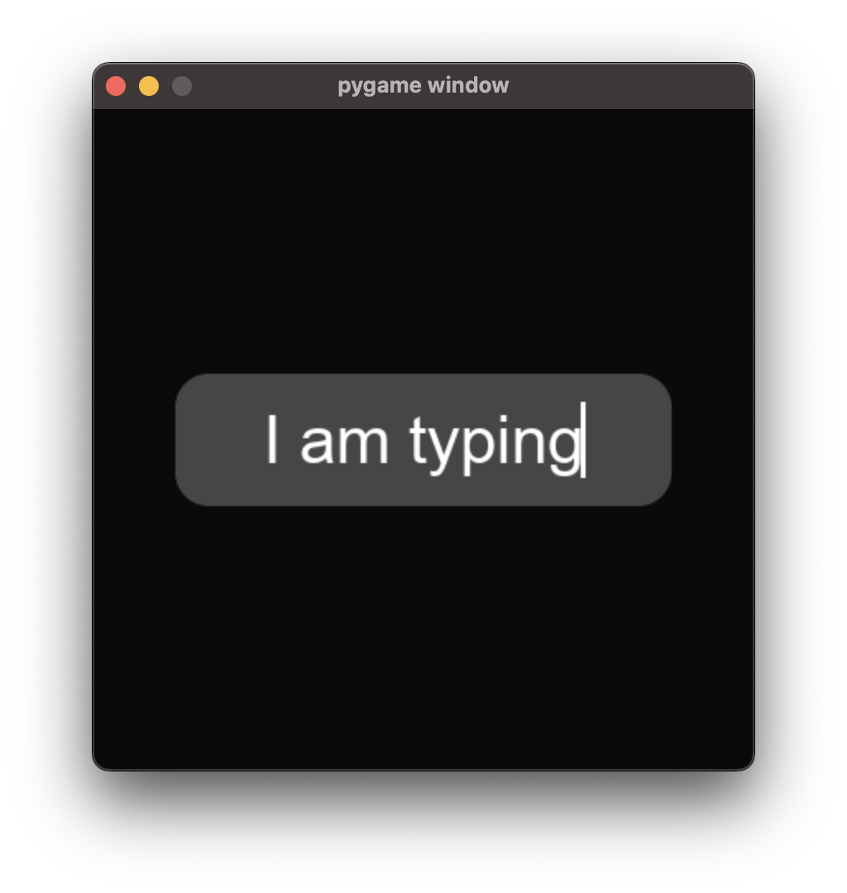

A text input. Set :code:`multiline = True` to make the text render on more than one line.

.. code-block:: python

    ember.TextField("")

When the contexts of the TextField are modified, an :code:`ember.TEXTFIELDMODIFIED` event is emitted. When the TextField is closed, an :code:`ember.TEXTFIELDCLOSED` event is emitted. Both the Event objects have the following attributes:

 - :code:`element` - The TextField element that posted the event.
 - :code:`text` - The text string.