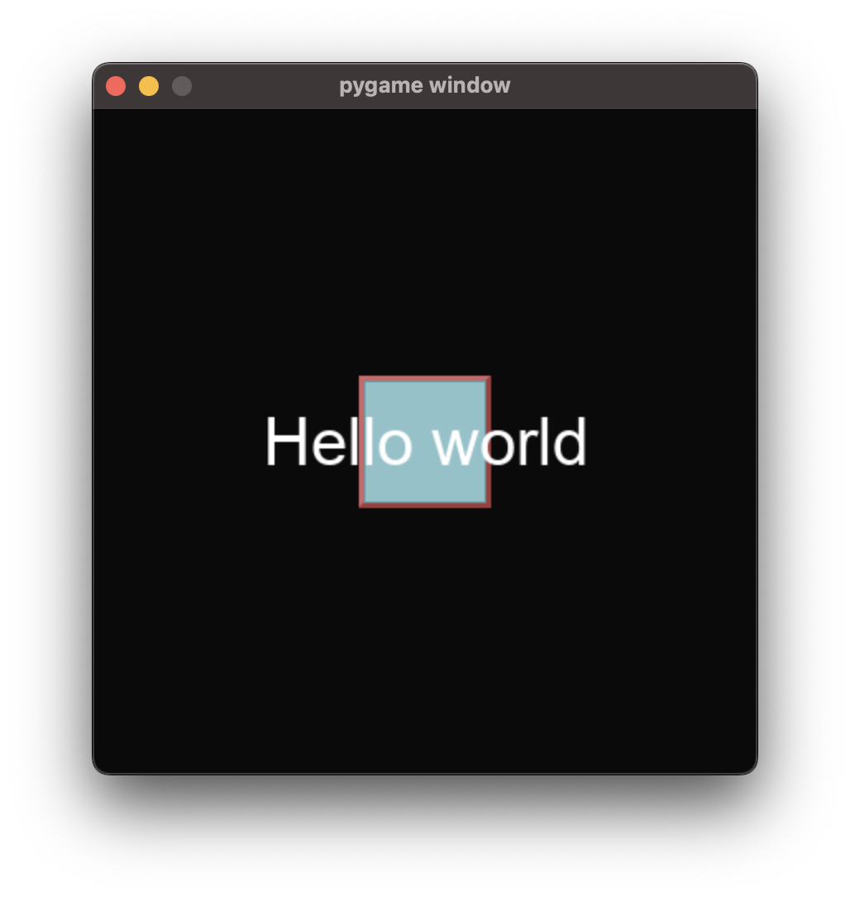
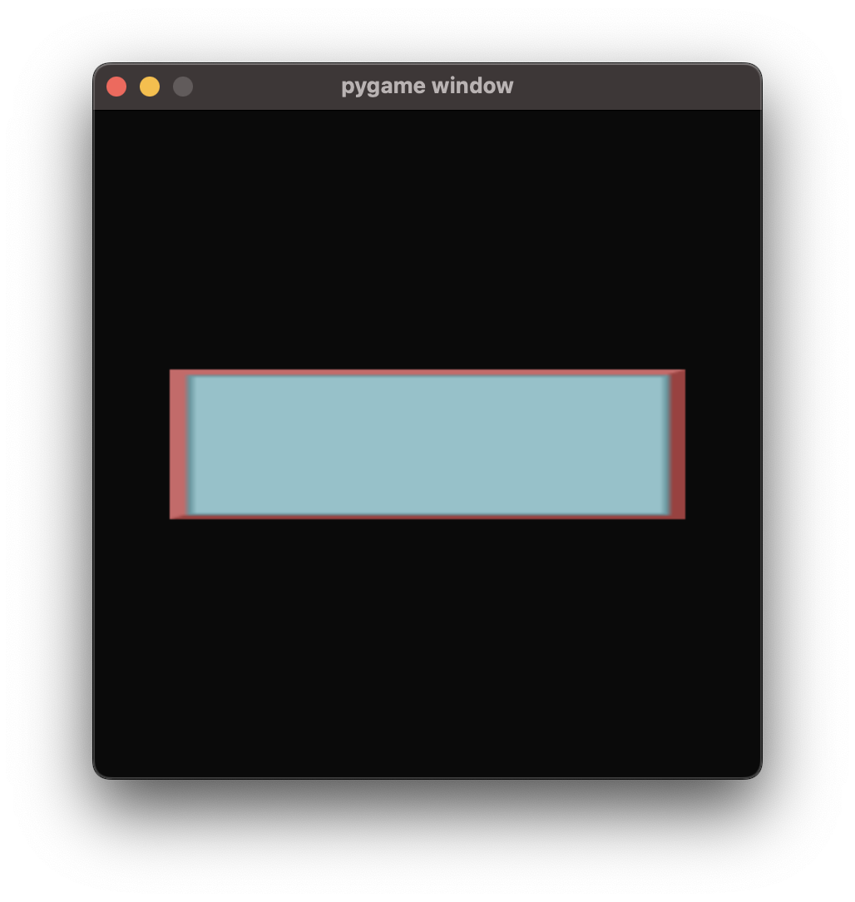
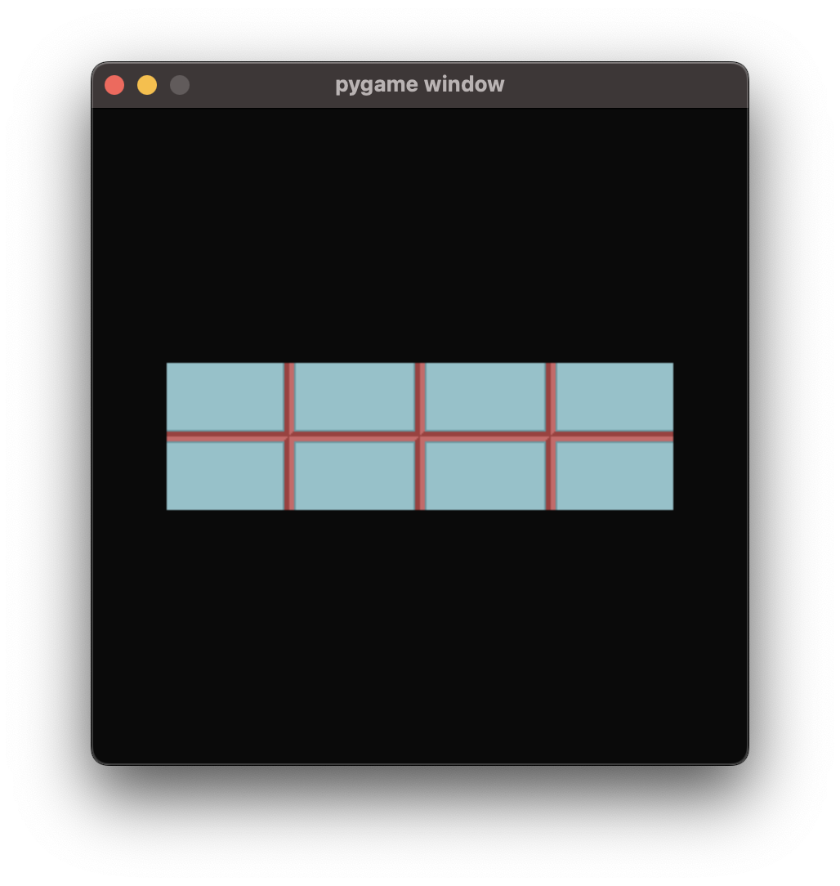
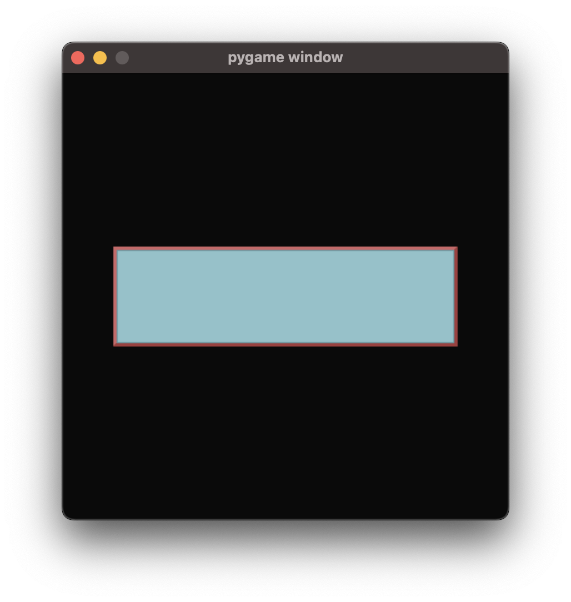

.. _material_guide:

Materials
===================================================

This page assumes that you've read the :ref:`Element Guide<element_guide>`.

Introduction
------------------------

The term 'material' is used to refer to an object that describes the appearance of a single aspect of an Element. This may sound confusing, but it becomes easier to understand after looking at some examples.

There are several different places where materials can be used. For instance, if you specify a material as the :code:`material` parameter of a Container, it will be rendered on the background of the container. For the below examples we'll be using the :py:class:`Box<ember.ui.Box>` Container, but this works the same way with :py:class:`VStack<ember.ui.VStack>`, :py:class:`HStack<ember.ui.HStack>`, :py:class:`Layout<ember.ui.Layout>`, etc.

You can use the same material object in as many places as you like, and it'll be handled correctly. You don't need to create a new material each time.

The remainder of this guide covers the different types of materials. You don't need to read all of this if you don't think it'll be relevant - feel free to jump around.

Color Materials
------------------------

Lets look at :py:class:`ember.material.Color` material, which represents a solid color.

.. image:: _static/material_guide/image1.png
  :width: 160
  :align: right

.. code-block:: python

    view = ember.View(
        ember.Box(
            ember.Text("Hello world"),
            material=ember.material.Color("red"),
            size=ember.FIT+50
        )
    )

There are other types of material, too. The :py:class:`ember.material.AverageColor` material fills the area with the average color of the surface beneath the material area.

In this example, an image is blitted to the screen before the View is rendered. Because the area where the material is drawn is green, the AverageColor material adopts a green color.

.. image:: _static/material_guide/image2.png
  :width: 160
  :align: right

.. code-block:: python

    view = ember.View(
        ember.Box(
            ember.Text("Hello world"),
            material=ember.material.AverageColor(),
            size=ember.FIT+50
        )
    )

Surface Materials
--------------------

There are 4 materials that can wrap a pygame Surface. The most basic of these is the :py:class:`Surface<ember.material.Surface>` material, which simply blits the wrapped surface in the centre of the material's area. This material does not resize the surface at all, so it doesn't actually appear to fill the material area. Hence, this is most useful in cases where you have a container with an absolute size that is the same size as the surface.

.. code-block:: python

    image = pygame.image.load("image.png").convert_alpha()
    material = ember.material.Surface(image)

    view = ember.View(
        ember.Box(
            ember.Text("Hello world"),
            size=ember.FIT+50,
            material=material
        )
    )

To solve this issue, the remaining 3 surface Materials resize the image to fill the area. Each material does this in a different way.

The :py:class:`ScaledSurface<ember.material.ScaledSurface>` material does this by using the :code:`pygame.transform.smoothscale` function, or :code:`pygame.transform.scale` if you specify :code:`smooth=False`.

.. code-block:: python

    image = pygame.image.load("image.png").convert_alpha()
    material = ember.material.ScaledSurface(image)

The :py:class:`RepeatedSurface<ember.material.RepeatedSurface>` material repeatedly blits the surface in a grid pattern.

.. code-block:: python

    image = pygame.image.load("image.png").convert_alpha()

    material = ember.material.RepeatedSurface(
        image,
        content_x=ember.CENTER,
        content_y=ember.CENTER
    )

The :py:class:`StretchedSurface<ember.material.StretchedSurface>` material works by scaling different parts of the surface by different amounts. It keeps the corners of the surface untouched, the edges of the surface are scaled on one axis only, and the middle of the surface is scaled on both axis. This is probably the most useful surface material.

.. code-block:: python

    image = pygame.image.load("image.png").convert_alpha()
    material = ember.material.StretchedSurface(image, edge=(5,5,5,5))

Shapes
-----------

.. image:: _static/material_guide/image3.png
  :width: 160
  :align: right

Lets look at another type of material - shapes. A shape material takes another material as a parameter, and masks it to a certain shape.

.. code-block:: python

    view = ember.View(
        ember.Box(
            ember.Text("Hello world!"),
            material=ember.material.RoundedRect(
                radius=20,
                material=ember.material.Color("red")
            ),
            size=ember.FIT + 50
        )
    )

Instead of a material, shapes can also take a color argument directly for convenience.

.. code-block:: python

    ember.material.RoundedRect(radius=20, color="red")

The other two types of shape are :py:class:`Ellipse<ember.material.shape.Ellipse>` and :py:class:`Capsule<ember.material.shape.Capsule>`.
