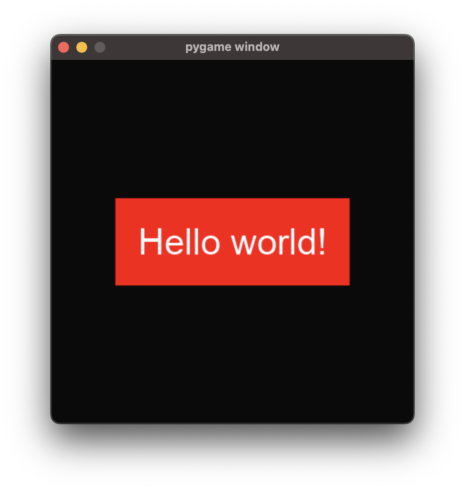
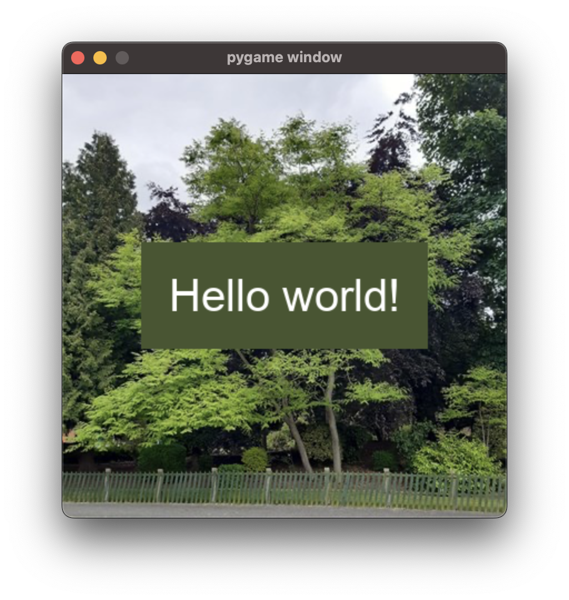

.. _material_guide:

Materials
===================================================

This page assumes that you've read the :ref:`Element Guide<element_guide>`.

Introduction
------------------------
The term 'material' is used to refer to an object that describes the appearance of a single aspect of an Element. This may sound confusing, but it becomes easier to understand after looking at some examples.

There are several different places where materials can be used. For instance, if you specify a material as the :code:`material` parameter of a Container, it will be rendered on the background of the container.

In the below example we will be using the :py:class:`ember.material.Color` material, which represents a solid color.

.. code-block:: python

    view = ember.View(
        ember.VStack(
            ember.Text("Hello world"),
            material=ember.material.Color("red"),
            size=ember.FIT+50
        )
    )

There are other types of material, too. For instance, the :py:class:`ember.material.AverageColor` material fills the area with the average color of the surface beneath the material area.

In this example, an image is blitted to the screen before the View is rendered. Because the area where the material is drawn is green, the AverageColor material adopts a green color.

.. code-block:: python

    view = ember.View(
        ember.VStack(
            ember.Text("Hello world"),
            material=ember.material.AverageColor(),
            size=ember.FIT+50
        )
    )

Shapes
-----------

Lets look at another type of material - shapes. A shape material takes another material as a parameter, and masks it to a certain shape.

.. code-block:: python

    view = ember.View(
        ember.VStack(
            ember.Text("Hello world!"),
            material=ember.material.RoundedRect(
                radius=20,
                material=ember.material.Color("red")
            ),
            size=ember.FIT + 50
        )
    )

Instead of a material, shapes can also take a color argument directly for convenience.

.. code-block:: python

    ember.material.RoundedRect(radius=20, color="red")

The other two types of shape are :py:class:`Ellipse<ember.material.shape.Ellipse>` and :py:class:`Capsule<ember.material.shape.Capsule>`.

Reusing Materials
-----------

You can pass the same material object to as many elements as you like, and it'll be handled correctly. You don't need to create a new material each time.