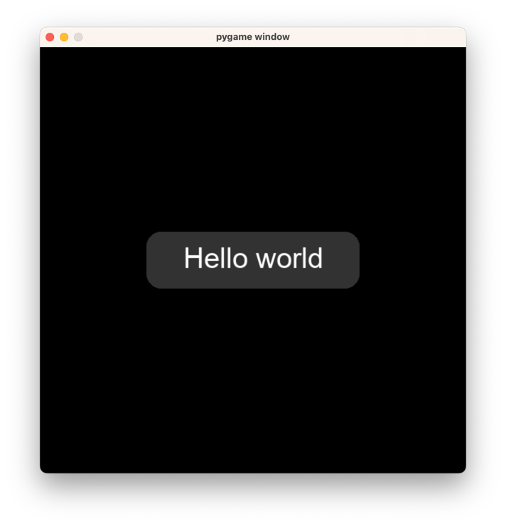

.. _quick-start:

Quick Start Guide
=================

This guide assumes a strong knowledge of Python (including OOP) and Pygame.

Here's a basic Pygame structure:

.. code-block:: python
   :linenos:

    import pygame
    pygame.init()

    screen = pygame.display.set_mode((600, 600))
    clock = pygame.time.Clock()
    is_running = True

    while is_running:

        for event in pygame.event.get():
            if event.type == pygame.QUIT:
                is_running = False

        screen.fill((20, 20, 20))
        clock.tick(60)
        pygame.display.flip()

    pygame.quit()

Let's add the lines required for Ember to function:

.. code-block:: python
   :linenos:
   :emphasize-lines: 2,5,6,11,22

    import pygame
    import ember

    pygame.init()
    ember.init()
    ember.style.load()

    screen = pygame.display.set_mode((600, 600))
    clock = pygame.time.Clock()

    ember.set_clock(clock)

    is_running = True

    while is_running:

        for event in pygame.event.get():
            if event.type == pygame.QUIT:
                is_running = False

        screen.fill((20, 20, 20))
        ember.update()

        clock.tick(60)
        pygame.display.flip()

    pygame.quit()

Now, we'll create a :code:`View` object. A View is just a menu. You can pass any :ref:`UI element<ui-element>` as the first parameter of the View. Lets add a View with a :ref:`Button<ui-button>` element:

.. code-block:: python
   :linenos:
   :emphasize-lines: 13,14,15,22,28

    import pygame
    import ember

    pygame.init()
    ember.init()
    ember.style.load()

    screen = pygame.display.set_mode((600, 600))
    clock = pygame.time.Clock()

    ember.set_clock(clock)

    view = ember.View(
        ember.Button("Hello world")
    )

    is_running = True

    while is_running:

        for event in pygame.event.get():
            view.event(event)
            if event.type == pygame.QUIT:
                is_running = False

        screen.fill((20, 20, 20))
        ember.update()
        view.update(screen)

        clock.tick(60)
        pygame.display.flip()

    pygame.quit()

If you run this code, you should see something like this:

