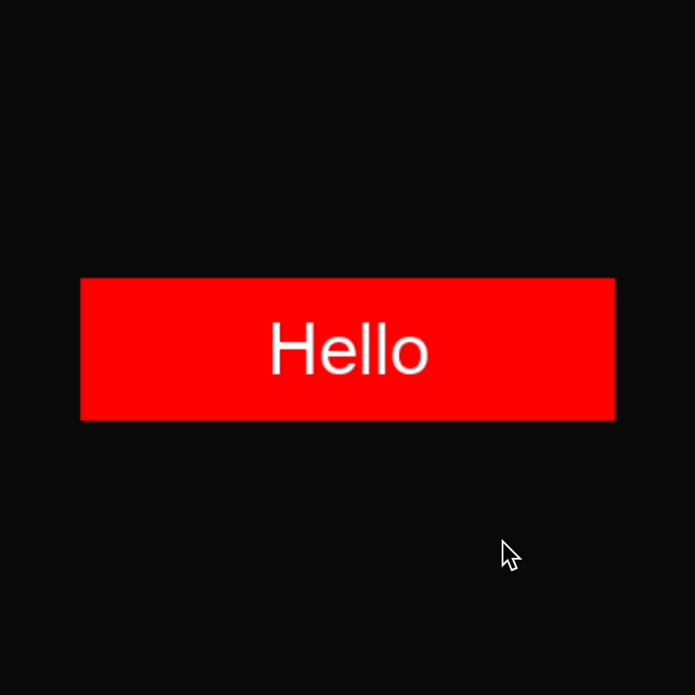

.. _state_guide:

States
===================================================

This page assumes that you've read all the previous guides in the 'getting started' section of the sidebar.

The basics
--------------

We've seen how Style objects can modify how an object looks. Similarly, 'State' objects describe how an element looks *under a specific condition*.

States are attributed to Style objects. Each Style object can have multiple state attributes. When an element is rendered, it chooses one of the Style's States as the 'active' state. When a state is 'active', the appearance it describes is applied to the element.

Let's look at :py:class:`ButtonState` first. The :py:class:`ButtonState` object takes a :code:`material` parameter. This material will be rendered on the Button when the State is active.

Here is a basic example.

.. code-block:: python

    red_state = ember.ButtonState(
        material=ember.material.Color("red")
    )
    blue_state = ember.ButtonState(
        material=ember.material.Color("blue")
    )

    button_style = ember.ButtonStyle(
        default_state=red_state,
        hover_state=blue_state
    )

    view = ember.View(
        ember.Button("Hello", style=button_style)
    )

This code produces a button that has a red background which turns blue when the Button is hovered over. This works because the :code:`hover_state` of the ButtonStyle becomes active when the user hovers over the Button. The :code:`default_state` becomes active if none of the ButtonStyle's other states have their conditions met.

Here's a full list of ButtonStyle's state attributes:

- :code:`default_state` - Is active when no other states are active. If this state is not specified, a blank state will be created and used.
- :code:`hover_state` - Becomes active when the user hovers over the button. If unspecified, the :code:`default_state` will be used.
- :code:`click_state` - Becomes active when the user is clicking down the button. If unspecified, the :code:`hover_state` will be used.
- :code:`focus_state` - Becomes active when the button is focused using keyboard or controller navigation. If unspecified, the :code:`hover_state` will be used.
- :code:`focus_click_state` - Becomes active when the Button is focused *and* clicked down. If unspecified, the :code:`click_state` will be used.
- :code:`disabled_state` - Becomes active when the Button is disabled. If unspecified, the :code:`default_state` will be used.

Replacing the active state logic
-----------------------------------

If you like, you can completely replace the active state logic by passing a function to the :code:`state_func` parameter of the ButtonStyle. Below, the default :code:`state_func` is shown. If you implement your own function, it must have the same signature.

.. code-block:: python

    def default_state_func(button: "Button") -> ButtonState:
        if button._disabled:
            return button._style.disabled_state
        elif button.is_clicked:
            return (
                button._style.focus_click_state
                if button.layer.element_focused is button
                else button._style.click_state
            )
        elif button.layer.element_focused is button:
            return button._style.focus_state
        elif button.is_hovered:
            return button._style.hover_state
        else:
            return button._style.default_state

Other examples
-----------------

States don't exclusively hold materials.